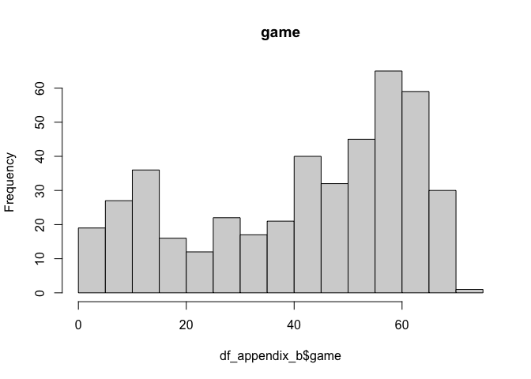
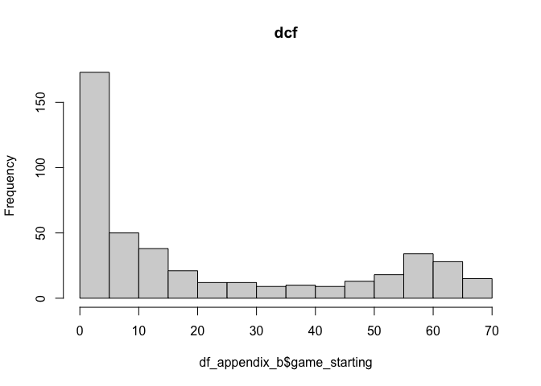

code
================
DS2
5/6/2022

## Part 0 - Data Preprocessing

## Part 1 - Exploratory Analysis

Since `minute` stands for minutes played per game, we will divided
variables stands for counts by `minute` to get a rate. These variables
includes `field_goal`, `fg_attempt` `x3p`, `x3p_attempt`, `x2p`,
`x2p_attempt`, `free_throw`, `ft_attempt`, `offensive_rb`
`defenssive_rb`, `total_rb`, `assistance`,`steal`, `block`, `turnover`,
`personal_foul` and `point`.

### Univariate Analysis

Distributions of the two categorical variables, `team` and `position`.

<!-- --><!-- -->

Distributions of other numeric variables.

<!-- --><!-- --><!-- -->

### Correlation Analysis

<!-- -->

### Analyzing trends in data

From numeric variables, we found that `stl`,`x3p`, `age`,`gs` seem to
have some non-linear trends.

<!-- -->

From categorical variable `position`, extremely high values in salary
show in all positions and some teams.

<!-- -->
