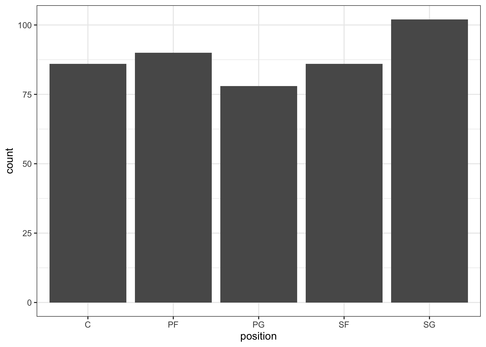
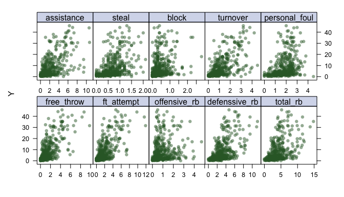

code
================
DS2
5/6/2022

## Part 0 - Data Preprocessing

## Part 1 - Exploratory Analysis

### Univariate Analysis

Distributions of the two categorical variables, `team` and `position`.

<!-- --><!-- -->

Distributions of other numeric variables.

<!-- -->

<!-- -->
<!-- -->

### Correlation Analysis

<!-- -->

### Analyzing trends in data

From numeric variables, we found that `stl`,`x3p`, `age`,`gs` seem to
have some non-linear trends.

<!-- --><!-- --><!-- -->

From categorical variable `position`, extremely high values in salary
show in all positions and some teams.

<!-- -->
