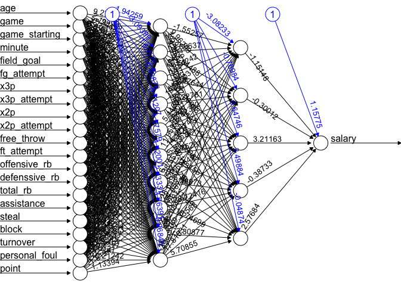
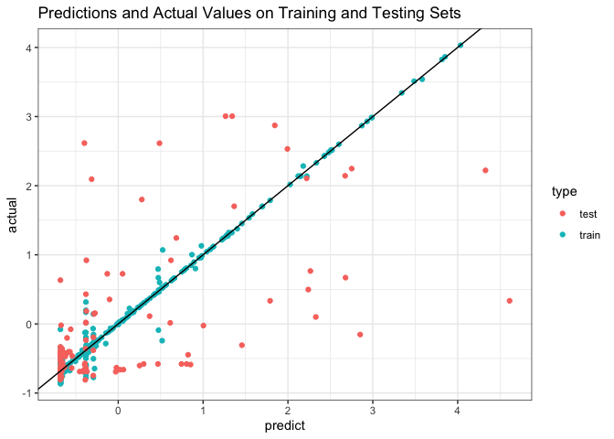
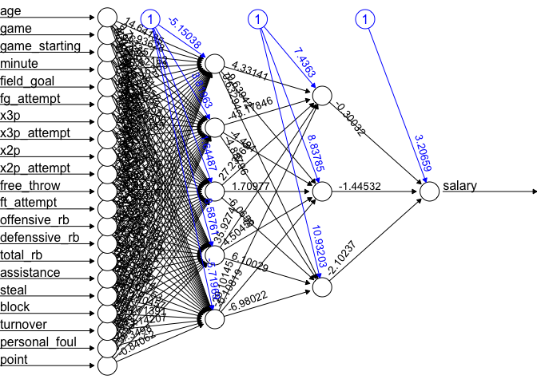
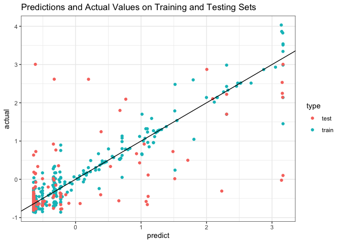
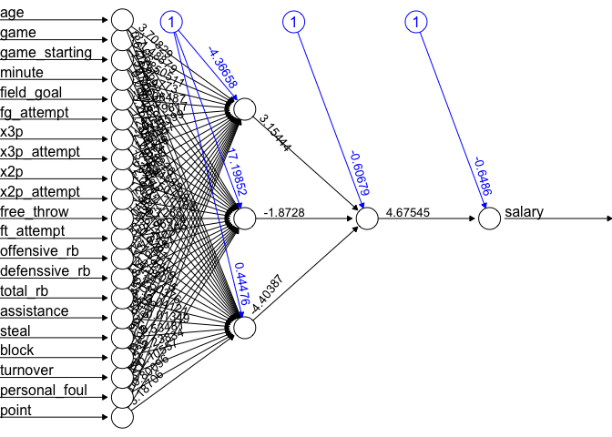
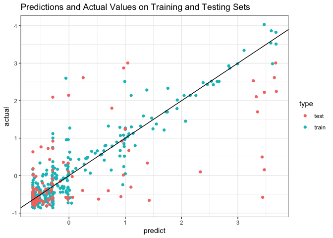
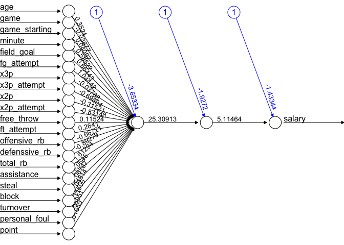
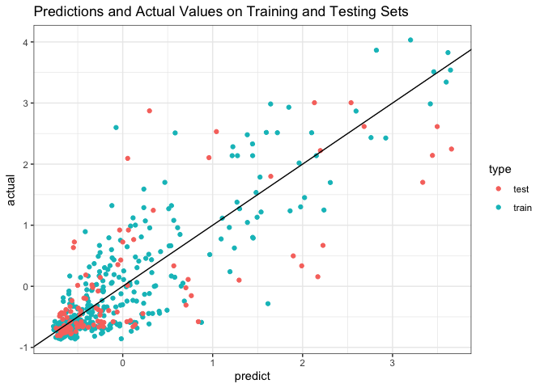
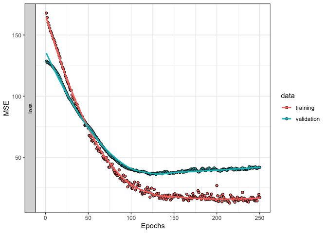

P8106 - Final Project
================
Mingkuan Xu (mx2262)
5/9/2022

``` r
library(tidyverse)
```

    ## ── Attaching packages ─────────────────────────────────────── tidyverse 1.3.1 ──

    ## ✓ ggplot2 3.3.5     ✓ purrr   0.3.4
    ## ✓ tibble  3.1.4     ✓ dplyr   1.0.7
    ## ✓ tidyr   1.1.3     ✓ stringr 1.4.0
    ## ✓ readr   2.0.1     ✓ forcats 0.5.1

    ## ── Conflicts ────────────────────────────────────────── tidyverse_conflicts() ──
    ## x dplyr::filter() masks stats::filter()
    ## x dplyr::lag()    masks stats::lag()

``` r
library(caret)
```

    ## Loading required package: lattice

    ## 
    ## Attaching package: 'caret'

    ## The following object is masked from 'package:purrr':
    ## 
    ##     lift

``` r
library(neuralnet)
```

    ## 
    ## Attaching package: 'neuralnet'

    ## The following object is masked from 'package:dplyr':
    ## 
    ##     compute

``` r
library(MASS)
```

    ## 
    ## Attaching package: 'MASS'

    ## The following object is masked from 'package:dplyr':
    ## 
    ##     select

``` r
library(keras)
```

    ## Warning: package 'keras' was built under R version 4.1.2

### Data Preprocessing

``` r
df_salary = read_csv("NBA_season2122_player_salary.csv") %>%
  janitor::clean_names() %>%
  dplyr::select(Player=x2,Team=x3,Salary=salary_4) %>%
  na.omit()
```

    ## New names:
    ## * `` -> ...1
    ## * `` -> ...2
    ## * `` -> ...3
    ## * Salary -> Salary...4
    ## * Salary -> Salary...5
    ## * ...

    ## Rows: 578 Columns: 11

    ## ── Column specification ────────────────────────────────────────────────────────
    ## Delimiter: ","
    ## chr (11): ...1, ...2, ...3, Salary...4, Salary...5, Salary...6, Salary...7, ...

    ## 
    ## ℹ Use `spec()` to retrieve the full column specification for this data.
    ## ℹ Specify the column types or set `show_col_types = FALSE` to quiet this message.

``` r
df_salary = df_salary[-1,]

df_stats = read_csv("NBA_season2122_player_stats.csv") %>%
  rename(Team=Tm) %>%
  dplyr::select(-Rk)
```

    ## Rows: 784 Columns: 30

    ## ── Column specification ────────────────────────────────────────────────────────
    ## Delimiter: ","
    ## chr  (3): Player, Pos, Tm
    ## dbl (27): Rk, Age, G, GS, MP, FG, FGA, FG%, 3P, 3PA, 3P%, 2P, 2PA, 2P%, eFG%...

    ## 
    ## ℹ Use `spec()` to retrieve the full column specification for this data.
    ## ℹ Specify the column types or set `show_col_types = FALSE` to quiet this message.

``` r
df_players = inner_join(x=df_salary,y=df_stats,by=c("Player","Team")) %>% 
  janitor::clean_names() %>% 
  distinct()

df_players = df_players %>% 
  arrange(player,desc(g)) %>% 
  distinct(player,.keep_all = TRUE)

# Removed variables with missing data and resulted from division of other variables
df_players = df_players %>% 
  dplyr::select(-x3p_percent, -ft_percent, -fg_percent,-x2p_percent,-e_fg_percent)

# The final generated dataset for use: df_player.
```

``` r
# Convert salary from characters to numbers.
# Convert categorical variables to factors

df_players = df_players %>% 
  separate(salary,into = c("symbol", "salary"),1) %>% 
  dplyr::select(-symbol)%>% 
  mutate(salary = as.numeric(salary)/1000000,
         team = factor(team),
         pos = factor(pos)) %>% 
  relocate(salary, .after = last_col())

colnames(df_players) = c("player", "team", "position", "age", "game","game_starting" ,"minute","field_goal", "fg_attempt", "x3p", "x3p_attempt" ,"x2p", "x2p_attempt",   "free_throw",   "ft_attempt", "offensive_rb", "defenssive_rb",  "total_rb" ,   "assistance" ,   "steal" , "block",    "turnover",  "personal_foul", "point", "salary")
```

``` r
df_players = df_players %>% 
  mutate(field_goal = field_goal/minute,
         fg_attempt = fg_attempt/minute,
         x3p = x3p/minute,
         x3p_attempt = x3p_attempt/minute,
         x2p = x2p/minute,
         x2p_attempt = x2p_attempt/minute,
         free_throw = free_throw/minute,
         ft_attempt = ft_attempt/minute,
         offensive_rb = offensive_rb/minute,
         defenssive_rb = defenssive_rb/minute,
         total_rb = total_rb/minute,
         assistance = assistance/minute,
         steal = steal/minute,
         block = block/minute,
         turnover = turnover/minute,
         personal_foul = personal_foul/minute,
         point = point/minute) 
```

``` r
# Data partition
set.seed(8106)

indexTrain <- createDataPartition(y = df_players$salary, p = 0.75, list = FALSE, times = 1)
ctrl1 <- trainControl(method = "cv", number = 10, repeats = 5)
```

    ## Warning: `repeats` has no meaning for this resampling method.

``` r
df_train = df_players[indexTrain,]
df_test = df_players[-indexTrain,]
```

### Blackbox

``` r
# Scale the data
df_train_scaled = as.data.frame(scale(
  df_train %>% dplyr::select(-team,-position,-player), 
  center = TRUE, scale = TRUE))

df_test_scaled = as.data.frame(scale(
  df_test %>% dplyr::select(-team,-position,-player), 
  center = TRUE, scale = TRUE))
```

``` r
set.seed(8106)


nn_with_m_n_layers = function(m,n){
  
# Build Neural Network
nn <- neuralnet(salary ~ ., 
                data = df_train_scaled, hidden = c(m, n), 
                linear.output = TRUE)
plot(nn,rep = "best")

summary(nn)


pr.train.nn <- compute(nn, df_train_scaled)
nn.train.MSE = mean((pr.train.nn$net.result - df_train_scaled$salary)^2)
nn.train.MSE

pr.test.nn <- compute(nn, df_test_scaled)
nn.test.MSE = mean((pr.test.nn$net.result - df_test_scaled$salary)^2)
nn.test.MSE

train.MSE.matrix[m,n] = nn.train.MSE
test.MSE.matrix[m,n] = nn.test.MSE

results_1 = 
  data.frame(predict = pr.train.nn$net.result, 
                       actual = df_train_scaled$salary) %>%
  mutate(type = "train")

results_2 = 
  data.frame(predict = pr.test.nn$net.result, 
                       actual = df_test_scaled$salary) %>%
  mutate(type = "test")

results = rbind(results_1,results_2)
  

ggplot(results) + geom_point(aes(x=predict,y=actual,color=type,group=type)) +
  labs(title = 'Predictions and Actual Values on Training and Testing Sets') +
  geom_abline(slope = 1, intercept = 0) +
  theme_bw()
}


matrix.row = 10
matrix.column = 5
train.MSE.matrix = matrix(nrow = matrix.row, ncol = matrix.column)
test.MSE.matrix = matrix(nrow = matrix.row, ncol = matrix.column)


# for(m in 9:matrix.row){
#   for(n in 4:matrix.column){
#     nn_with_m_n_layers(m,n)
#   }
# }

nn_with_m_n_layers(10,5)
```

<!-- --><!-- -->

``` r
nn_with_m_n_layers(5,3)
```

<!-- --><!-- -->

``` r
nn_with_m_n_layers(3,1)
```

<!-- --><!-- -->

``` r
nn_with_m_n_layers(1,1)
```

<!-- --><!-- -->

``` r
lr = lm(salary ~.,
            data = df_train_scaled)

pr.train.lr = predict(lr, df_train_scaled)
lr.train.MSE = mean((pr.train.lr - df_train_scaled$salary)^2)

pr.test.lr = predict(lr, df_test_scaled)
lr.test.MSE = mean((pr.test.lr - df_test_scaled$salary)^2)
```

### <https://www.geeksforgeeks.org/how-neural-networks-are-used-for-regression-in-r-programming/>

### Blackbox using keras

``` r
p <- ncol(df_train_scaled) - 1
model_1 <- keras_model_sequential()
```

    ## Loaded Tensorflow version 2.8.0

``` r
model_1 %>% 
  layer_dense(units = 10, activation ="relu", input_shape = 21) %>%
  layer_dense(units = 5, activation = "relu") %>%
  layer_dense(units = 1, activation = "linear") 

summary(model_1)
```

    ## Model: "sequential"
    ## ________________________________________________________________________________
    ##  Layer (type)                       Output Shape                    Param #     
    ## ================================================================================
    ##  dense_2 (Dense)                    (None, 10)                      220         
    ##                                                                                 
    ##  dense_1 (Dense)                    (None, 5)                       55          
    ##                                                                                 
    ##  dense (Dense)                      (None, 1)                       6           
    ##                                                                                 
    ## ================================================================================
    ## Total params: 281
    ## Trainable params: 281
    ## Non-trainable params: 0
    ## ________________________________________________________________________________

``` r
# L2 regularization
model_2 <- keras_model_sequential()
model_2 %>% 
  layer_dense(units = 10, activation ="relu", input_shape = p,
              kernel_regularizer = regularizer_l2(0.001)) %>%
  layer_batch_normalization() %>%
  layer_dense(units = 5, activation = "relu",
              kernel_regularizer = regularizer_l2(0.001)) %>%
  layer_batch_normalization() %>%
  layer_dense(units = 1, activation = "linear") 

summary(model_2)
```

    ## Model: "sequential_1"
    ## ________________________________________________________________________________
    ##  Layer (type)                       Output Shape                    Param #     
    ## ================================================================================
    ##  dense_5 (Dense)                    (None, 10)                      220         
    ##                                                                                 
    ##  batch_normalization_1 (BatchNormal  (None, 10)                     40          
    ##  ization)                                                                       
    ##                                                                                 
    ##  dense_4 (Dense)                    (None, 5)                       55          
    ##                                                                                 
    ##  batch_normalization (BatchNormaliz  (None, 5)                      20          
    ##  ation)                                                                         
    ##                                                                                 
    ##  dense_3 (Dense)                    (None, 1)                       6           
    ##                                                                                 
    ## ================================================================================
    ## Total params: 341
    ## Trainable params: 311
    ## Non-trainable params: 30
    ## ________________________________________________________________________________

``` r
# Dropout
model_3 <- keras_model_sequential()
model_3 %>% 
  layer_dense(units = 10, activation ="relu", input_shape = p) %>%
  layer_batch_normalization() %>%
  layer_dense(units = 5, activation = "relu") %>%
  layer_batch_normalization() %>%
  layer_dense(units = 1, activation = "linear") 

summary(model_3)
```

    ## Model: "sequential_2"
    ## ________________________________________________________________________________
    ##  Layer (type)                       Output Shape                    Param #     
    ## ================================================================================
    ##  dense_8 (Dense)                    (None, 10)                      220         
    ##                                                                                 
    ##  batch_normalization_3 (BatchNormal  (None, 10)                     40          
    ##  ization)                                                                       
    ##                                                                                 
    ##  dense_7 (Dense)                    (None, 5)                       55          
    ##                                                                                 
    ##  batch_normalization_2 (BatchNormal  (None, 5)                      20          
    ##  ization)                                                                       
    ##                                                                                 
    ##  dense_6 (Dense)                    (None, 1)                       6           
    ##                                                                                 
    ## ================================================================================
    ## Total params: 341
    ## Trainable params: 311
    ## Non-trainable params: 30
    ## ________________________________________________________________________________

``` r
model_3 %>% compile(loss = "mse",
                   optimizer = optimizer_rmsprop())
#                   metrics = "mse")
```

``` r
set.seed(8106)

df_train_noc = as.data.frame(df_train %>% dplyr::select(-team,-player,-position))
df_train_scaled_x = scale(model.matrix(salary~., df_train_noc)[,-1],center = TRUE, scale = TRUE)

df_train_scaled_y = df_train$salary

df_test_noc = as.data.frame(df_test %>% dplyr::select(-team,-player,-position))
df_test_scaled_x = scale(model.matrix(salary~., df_test_noc)[,-1],center = TRUE, scale = TRUE)
df_test_scaled_y = df_test$salary

learn <- model_3 %>% fit(df_train_scaled_x, df_train_scaled_y, 
                        epochs = 250,
                        batch_size = 32,
                        validation_split = 0.2,
                        verbose = 2)
# loss and accuracy metric for each epoch
plot(learn) + xlab("Epochs") + ylab("MSE") + theme_bw()
```

    ## `geom_smooth()` using formula 'y ~ x'

<!-- -->

``` r
# ggsave(filename = "report_figures/figure_nn_2.png",dpi = 300,width = 6, height = 4)
```

``` r
score <- 
  model_3 %>% evaluate(df_test_scaled_x, df_test_scaled_y)
score
```

    ##     loss 
    ## 38.82305
