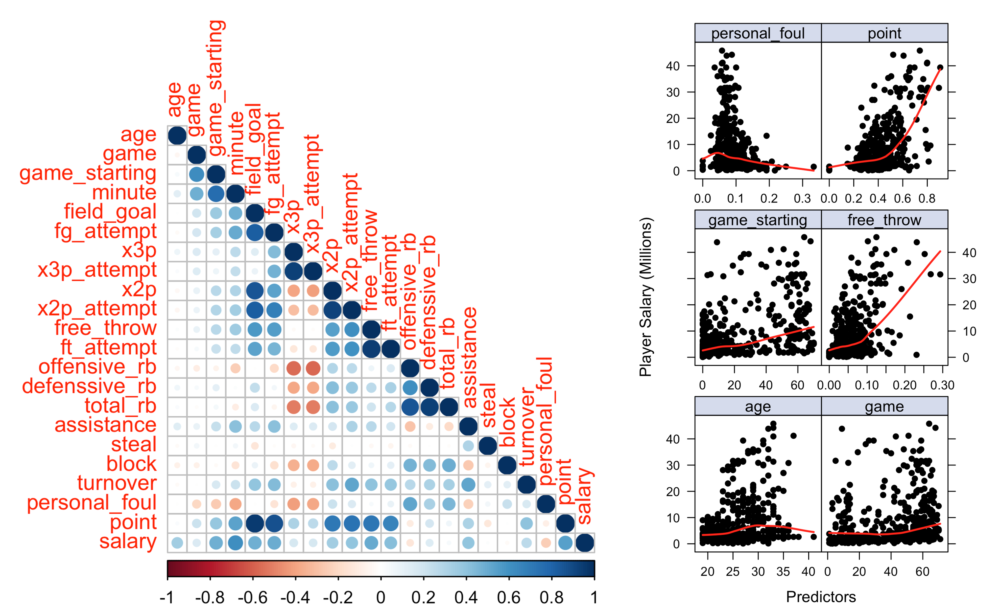
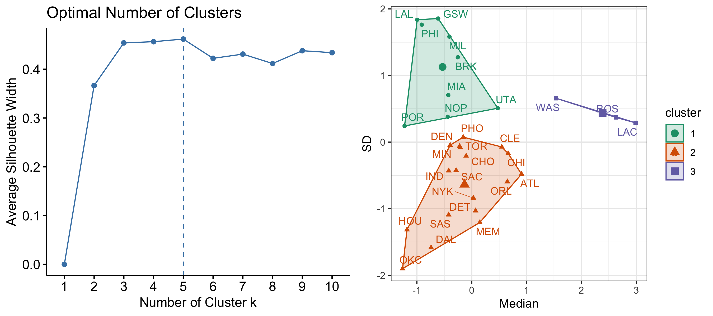
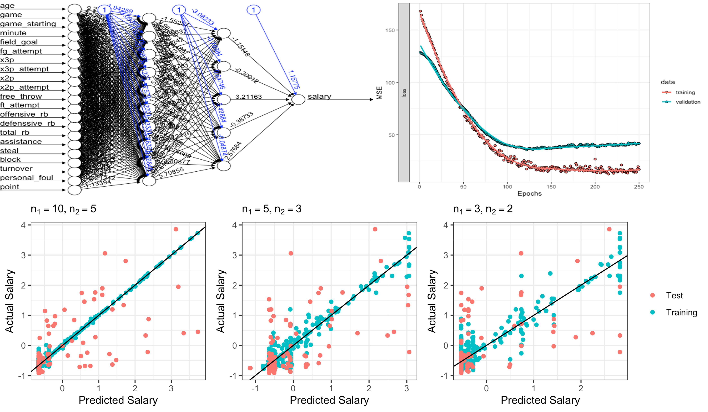
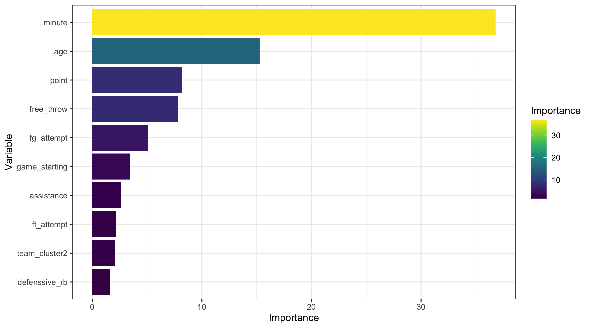
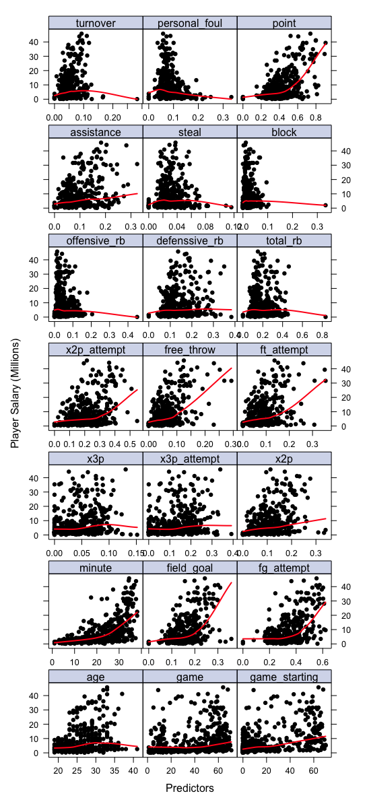
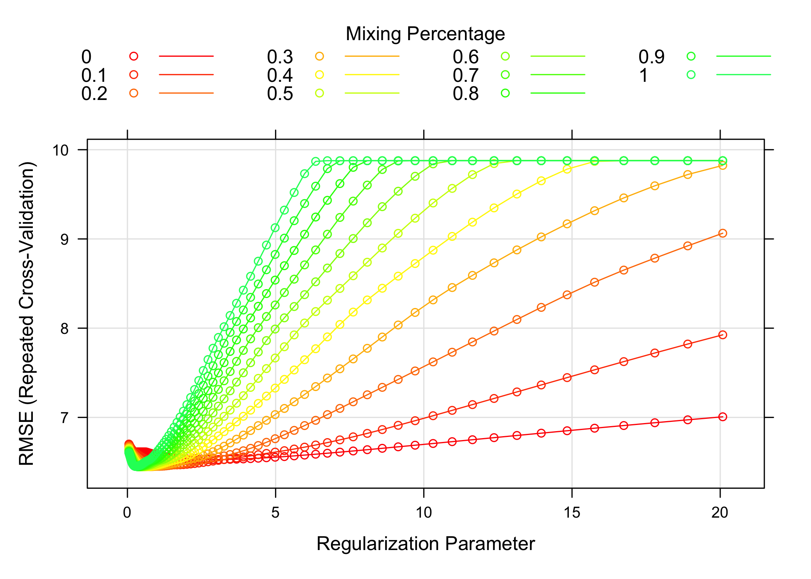
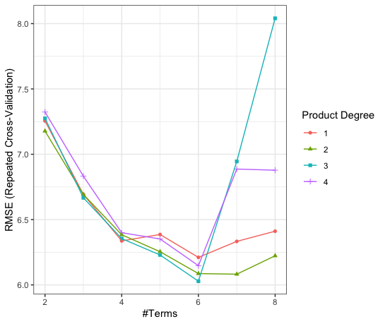
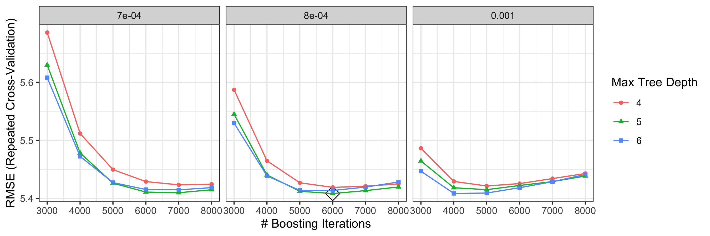

## Introduction

For teams in the National Basketball Association (NBA), a key strategy to win more games is to properly allocate their salary cap - an agreement that places a limit on the amount of money that a team can spend on players' salaries. How to evaluate the performance of each NBA player and give a suitable level of salary is a complicated problem. In this project, we intend to predict the salary of NBA players in the 2021-2022 season based on their game statistics. We collected game statistics that are commonly used to evaluate players from the NBA official website, built linear, generalized linear, tree-based, and blackbox models, and conducted model comparison to determine a final predictive model. 

## Data Preprocessing

The data used for exploratory analysis and model construction are based on two datasets: the NBA players' contracted salary dataset [1] and game performance statistics dataset [2] in 2021-2022. The data were preprocessed using the following pipeline:

 - Two original datasets were inner joined by players and teams
 - Kept only one record with most number of games played for each of players, given a player may transfer to other teams during the session and have multiple records.
 - Removed 5 variables with missing values caused by division of other existing variables. 
 - Divided count variables (`field_goal`, `free_throw`, etc.) by variable `minute` to convert them to efficiency.

The final cleaned dataset contained 442 records and 24 variables, including 2 categorical variables, 21 numerical variables and 1 numeric response variable `salary` (Table 1).

Table: Table of Variables

| Variable Name|  Meaning                                      | Variable Type         |
|:------------ |:----------------------------------------------|:-----------------------|
|position      |Position of the player                         |categorical (5 classes) |
|age           |Player's age on February 1 of the season       |numeric                 |
|team          |Team that the player belong to                 |categorical (30 classes)|
|game          |Number of games played                         |numeric                 |
|game_starting |Number of games played as a starter            |numeric                 |
|minute        |Minutes played per game                        |numeric                 |
|field_goal    |Field goals per minute                         |numeric                 |
|fg_attempt    |Field goal attempts per minute                 |numeric                 |
|x3p           |3-point field goals per minute                 |numeric                 |
|x3p_attempt   |3-point field goal attempts per minute         |numeric                 |
|x2p           |2-point field goals per minute                 |numeric                 |
|x2p_attempt   |2-point field goal attempts per minute         |numeric                 |
|free_throw    |Free throws per minute                         |numeric                 |
|ft_attempt    |Free throw attempts per minute                 |numeric                 |
|offensive_rb  |Offensive rebounds per minute                  |numeric                 |
|defenssive_rb |Defensive rebounds per minute                  |numeric                 |
|total_rb      |Total rebounds per minute                      |numeric                 |
|assistance    |Assists per minute                             |numeric                 |
|steal         |Steals per minute                              |numeric                 |
|block         |Blocks per minute                              |numeric                 |
|turnover      |Turnovers per minute                           |numeric                 |
|personal_foul |Personal fouls per minute                      |numeric                 |
|point         |Points per minute                              |numeric                 |
|salary        |Salary of the player in million (Response)     |numeric                 |

## Exploratory Analysis 

### Univariate Analysis

The distribution of each variable in the dataset was plotted and examined (see Appendix A). Categorical variables `team` and `position` were distributed quite evenly. While 30 unique values in `team` might lead to too many dummy variables in the model, the variable was considered to be excluded or clustered into fewer classes for model fitting. For numeric variables, some of them (`game_starting`, `free_throw`, `offenssive_rb`,`block`), including response `salary` are skewed, with some players have extremely high salary.

### Correlation Analysis

From the correlation heat map (figure 1A), some variables were found to be strongly correlated with others, leading to a potential problem of multicolinearity. Such problem could be handled by using penalized models (such as ridge/lasso regression and elastic-net) or ensembled models (such as random forest, boosting, and neural network). From the feature maps (figure 1B), some predictive variables (such as `age`,`game`, `game_starting`,`free_throw`, `personal_foul`, `point`) were found to have non-linear correlations with `salary`. Generalized linear regression models and other non-linear models, including GAM, MARS, random forest and neural network model, could be used to capture such non-linearity.

## Feature Engineering

To condense the 30-class categorical variable `team` into fewer dummy variables, we tried clustering `team` into fewer classes based on the median and standard deviation of player's salary in each team. The number of clusters $k = 3$ was chosen based on average silhouette width. The resulting clusters of `team` were stored in a new variable`team_cluster` and presented below :

* Cluster 1: BRK, GSW, LAL, MIA, MIL, NOP, PHI, POR, UTA
* Cluster 2: ATL, CHI, CHO, CLE, DAL, DEN, DET, HOU, IND, MEM, MIN, NYK, OKC, ORL, PHO, SAC, SAS, TOR
* Cluster 3: BOS, LAC, WAS

In the tree-based models, the replacement of `team` with `team_cluster` led to a higher prediction accuracy. For other models, the variable `team`was still used for model construction.

## Model Construction

After having an overview of the data, we splitted the dataset into training (80%) and test (20%) set, used 10-fold repeated cross validation to compare each model using training data, and evaluated the model performances based on test error. We built 8 types of models in four categories: 

1. Linear Regression Models: Standard Linear Regression Model, Elastic Net Model, Principal Component Regression Model (PCR)

2. Generalized Linear Regression: Generalized Addictive Model (GAM), Multivariate Adaptive Regression Splines Model (MARS)

3. Tree based Models Models: Random Forest (RF), Generalized Boosted Regression Modeling (GBM)

4. Neural Network

### Part A - Linear Regression Models

#### (1) Standard Least-Squared

Standard Least-Squared model is used for a reference of other models, as it may not perform well given the presence of multicolinearity and nonliner trend in the data. There is no tuning parameter for standard least-squared model.

#### (2) Elastic Net 

The elastic-net model has two parameters, which are $\alpha$ (compromise between LASSO and ridge) and $\lambda$ (the penalty term limits the number or magnitude of predictor coefficients). The elastic-net model reached its best tune at $\alpha = 0.6$ and $\lambda = 0.44$ (see Appendix B Figure1).

#### (3) Principle Component Regression

The tuning parameter of PCR is the number of principal components (PCs) included in the final model. There are 12 PCs included in the model with minimum RMSE (see Appendix B Figure2). 

### Part B - Generalized Linear Regression Models

#### (4) GAM

There is no tuning parameter for GAM. The GAM model can capture the non-linear trend in the model, but it may have a high variance. `age`, `game_starting`, `assistance`, `personal_foul`, and `point` are statistically significant predictors at 0.0001 significant level.

#### (5) MARS

The tuning parameter for MARS is `nprune` and `degree`. When attempting to fit the MARS model, we noticed that the RMSE increased drastically when degree is over 3 and nprune is over 8. Therefore, we would choose the range of degrees as 1:4 and range of nprune as 2:8. When `nprune = 6` and `degree = 3`, MARS model reached its best tune and RMSE is lowest. 6 of 54 predictors are included in the mdoel, and the top 3 important predictors are: `age`, `minute`, `game`. MARS model is highly adaptive comparing with previous models and has a higher prediction accuracy (see Appendix B Figure3).

### Part 3: Tree-Based Models 

#### (6) Random Forest

Tuning parameter for random forest regression in package `ranger` are `mtry` (number of variables to split at in each node) and `min.node.size` (minimal size of each node). Through 10-fold repeated CV (see Appendix C Figure1), the optimal random forest model have parameters `mtry = 26` and `min.node.size = 1`. Random forest preserve the advantage of single decision trees that can handle correlation between variables and non-linearity. However, since here `mtry = 26` equals our total number of variables, this random forest estimator may not well decorrelate single trees, and thus may overfit the dataset. 

#### (7) Generalized Boosted Regression Modeling (GBM)

Tuning parameters for Generalized boosted regression modeling (GBM) are `n.trees ` (total number of trees to fit), `interaction.depth` (maximum depth of each tree), `shrinkage` (learning rate), and `n.minobsinnode ` (minimum number of observations in the terminal nodes). Through 10-fold repeated CV (see Appendix C Figure2), the optimal random forest model have parameters `n.trees = 6000`, `interaction.depth = 5`, `shrinkage = 0.0008`, and `n.minobsinnode = 1`.

### Part 4: Neural Network

Several 2-hidden layer neural networks were built to fit the data. The optimal model fitted after parameter tuning is a 2-hidden layer neural network with $n_1 = 10$ and $n_2 = 5$ nodes in the first and second layers, applying dropout regularization. Figure 3B shows the resulting MSE in the training and validation sets after 250 epochs.

As shown in Figure 3C, as the number of nodes in the first and second hidden layers increases, neural networks can provide very accurate fittings of the training data, with much lower MSEs compared to other methods. However, the predictions are not satisfying when the models are applying to the test data.

Despite trying different number of nodes and applying regularization techniques (L2 and dropout), the resulting models still have a noticeable overfitting problem. Given the size of the dataset is very small ($n=442$), the performance of neural network is not as good as some traditional statistical models. It is more useful when the size of dataset is much larger with more variables.

## Model Comparasion and Final Model Interpretation

### Model Comparison

The 10-fold CV RMSE (validation set RMSE for neural network) and test set RMSE for all candidate models are shown in Table 2. The GBM model has the best performance in terms of both CV and test errors. 

Table: Summary of Model Performance

|             |Linear|ElasticNet| PCR  | GAM  | MARS | RandomForest | GBM  | NeuralNetwork |
|:------------|:-----|:---------|:-----|:-----|:-----|:-------------|:-----| :-------------|
|Training RMSE| 6.79 |   6.45   | 7.16 | 6.84 | 6.06 |     5.42     | 5.41 |     6.40      |
|  Test RMSE  | 6.66 |   6.04   | 5.39 | 6.84 | 5.16 |     4.83     | 4.75 |     6.64      |

### Final Model Interpretation

Based on the CV RMSE and validation set RMSE,  our best model is the Generalized Boosted Regression Modeling (GBM) with tuning parameters: 

* `n.trees = 6000`

* `interaction.depth = 5`

* `shrinkage = 0.0008`:

* `n.minobsinnode = 1`

10 most important variables (computed from permuting OOB data) are `minute`, `age`, `point`, `free_throw`, `fg_attempt`, `game_starting`, `assistance`, `ft_attempt`, `team_cluster`, and `defensive_rb` (Figure 4). 

With our fitted GBM model, we can make prediction on new observations. The RMSE on our test data is 4.745948.

Given that GBM is a black-box model, we refer to `lime` package to achieve explanations of the result of the model on new observations, by fitting a simpler model to the permuted data with the above 15 most important features. Table 3 displays 6 randomly selected observations from the test data. The players' name, true salary (in million), and predicted salary from GBM are shown.

Table: Prediction on Randomly Selected New Observations

| player           | salary (true) | salary (predicted by GBM) |
|:-----------------|------------:|-----------------:|
| Cade Cunningham  |   10.050120 |         8.590867 |
| Cam Reddish      |    4.670160 |         3.627087 |
| Christian Wood   |   13.666667 |        14.730414 |
| Corey Kispert    |    3.383640 |         3.248053 |
| D’Angelo Russell |   30.013500 |        14.735256 |
| Danuel House Jr. |    2.045094 |         4.792719 |

The explanation of the GBM model from lime are shown in Figure 5. Inside the plot, the x-axis shows the relative strength of each variables, and positive values (blue) show that the the variable increase the value of the prediction, while the negative values (red) decrease the prediction value. 

{height=50%}

Take the first case of player Cade Cunningham as an example. Cade's true salary is 10.050120 million. His predicted salary from GBM is 8.590868 million, which are quite similar to each other. Among the 10 most important variables, factors `mintue > 90`, `point > 0.5`,  `game_starting > 43.8`, `assistance > 0.1241`, `fg_attempt > 0.401` and `x2p_attempt > 0.269` increases Cade's salary, while factors `age <= 23`, `turnover > 0.065`, `0.057 < free_throw <= 0.082` and `team_cluster = 2` decreases his salary.

## Conclusion

In this project, we explored different ways of building statistical models to predict the salary of NBA players based on their game statistics. We preprocessed the original raw data by removing missing values, joining datasets, and deriving more meaningful variables based on the existing ones. We then conducted an exploratory analysis to detect useful patterns in variable distribution and their correlations. To deal with the problems emerging from the preliminary analysis, such as co-linearity, non-linearity, and a large number of dummy variables, we did feature engineering to collapse categories, conducted variable selection to reduce model dimensions, applied various regularization techniques to prevent model overfitting, and introduced more sophisticated statistical methods to capture non-linear relationships. Among the 8 models fitted, we selected the GBM as the final predictive model after evaluating their performances on cross validation RMSE. Applying the final model on the test set, it also achieved a small RMSE value, indicating an excellent prediction accuracy and a low level of over-fitting. Other models did not achieve the same level of prediction accuracy as the GBM, either underfitting the data with higher RMSE on the training set or fitting the training data too well (particularly, in the case of the neural network model).

From the GBM model, we also gained insights into important variables that influence the player's salary, among which the top 10 variables are `minute`, `age`, `point`, `free_throw`, `fg_attempt`, `game_starting`, `assistance`, `ft_attempt`, `team_cluster`, and `defensive_rb`. These findings are consistent with our understanding of factors that commonly affect the income of NBA players.

The study has several limitations. Interaction analysis can be conducted in the family of linear regression models. In building the neural network, we only used trained the multilayer perceptron with the ReLU activation functions. Several other model structures and activation functions are worth trying in the future.  The model accuracy can be further improved by introducing new variables. For example, the current salary level of a player should be more related to his performance in the year before making the new contract. Therefore, apart from the statistics for 2021-2022 season, player data from previous seasons can also be included in the analysis. Furthermore, some players having a high salary may suffer injuries in recent games; injury data can also be taken into account.

\newpage

## References

[1]https://www.basketball-reference.com/contracts/players.html

[2]https://www.basketball-reference.com/leagues/NBA_2022_per_game.html

\newpage

## Appendices

### Appendix A - Numeric Variable Distribution

{height=80%}

\newpage

{height=70%}

\newpage

### Appendix B - Linear Regerssion

\newpage

### Appendix C - Tree-based Models

