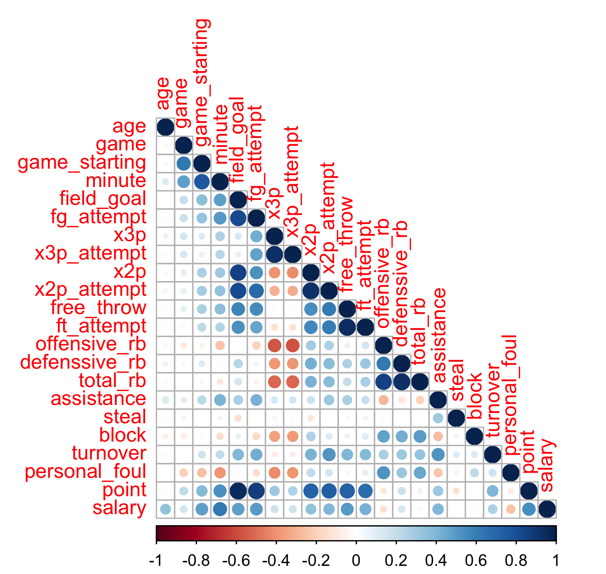
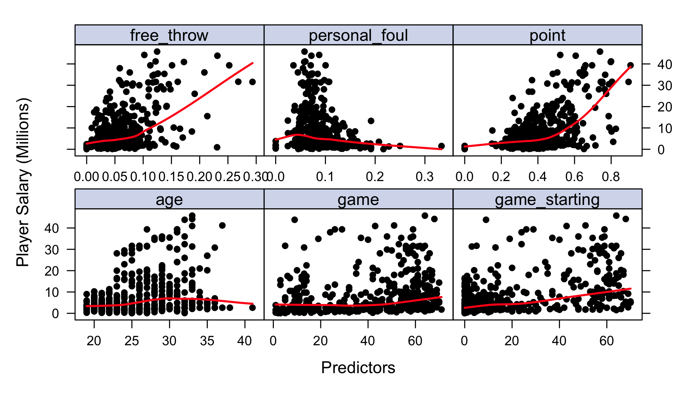
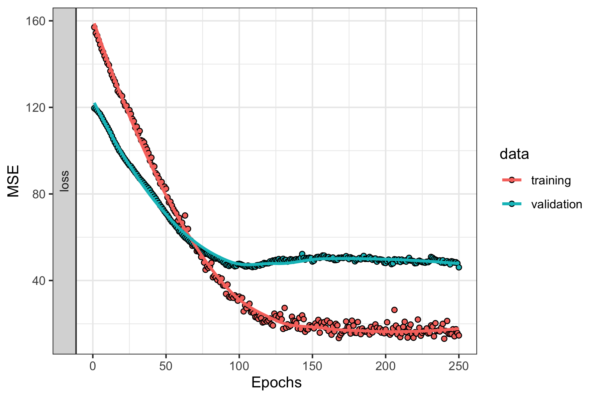
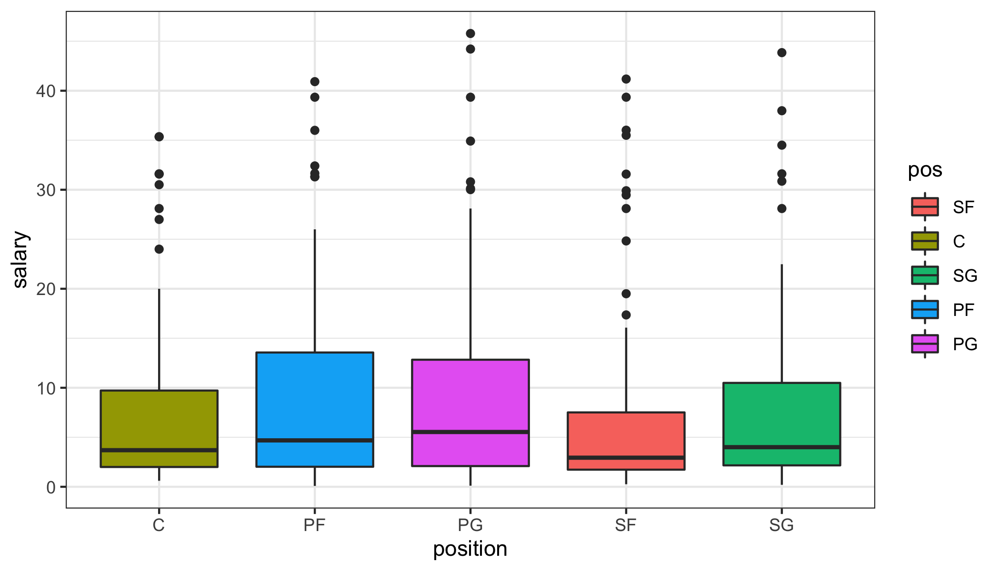

## Introduction

For teams in the National Basketball Association (NBA), a key strategy to win more games is to properly allocate their salary cap - an agreement that places a limit on the amount of money that a team can spend on players' salaries. How to evaluate the performance of each NBA player and give a suitable level of salary is a complicated problem. In this project, we intend to predict the salary of NBA players in the 2021-2022 season based on their game statistics. We collected game statistics that are commonly used to evaluate players from the NBA official website, built both linear and non-linear models, including linear regression, elastic net regression, principle component regression (PCR), generalized addictive model (GAM), multivariate adaptive regression spline (MARS) model, random forest and neural network on selected feature variables, and compared these models to determine a final predictive model. 

## Data Preprocessing

We will conduct data analysis and model construction based on two datasets on NBA players' contracted salary [1] and performance statistics per game [2] in 2021-2022. The following steps are included in our data preparation:

 - Two original datasets were inner joined by players and teams
 - Kept only one record with most number of games played for each of players, given a player may transfer to other teams during the session and have multiple records.
 - Removed 5 variables with missing values caused by division of other existing variables. 
 - Divided count variables (`field_goal`, `free_throw`, etc.) by variable `minute` to convert them to efficiency

The final cleaned dataset has 442 records and 24 variables, including 2 categorical variables, 21 numerical variables and 1 numeric response variable `salary`.

| Variable Name|  Meaning                                      | Varianble Type         |
|:------------ |:----------------------------------------------|:-----------------------|
|position      |Position of the player                         |categorical (5 classes) |
|age           |Player's age on February 1 of the season       |numeric                 |
|team          |Team that the player belong to                 |categorical (30 classes)|
|game          |Number of games played                         |numeric                 |
|game_starting |Number of games played as a starter            |numeric                 |
|minute        |Minutes played per game                        |numeric                 |
|field_goal    |Field goals per minute                         |numeric                 |
|fg_attempt    |Field goal attempts per minute                 |numeric                 |
|x3p           |3-point field goals per minute                 |numeric                 |
|x3p_attempt   |3-point field goal attempts per minute         |numeric                 |
|x2p           |2-point field goals per minute                 |numeric                 |
|x2p_attempt   |2-point field goal attempts per minute         |numeric                 |
|free_throw    |Free throws per minute                         |numeric                 |
|ft_attempt    |Free throw attempts per minute                 |numeric                 |
|offensive_rb  |Offensive rebounds per minute                  |numeric                 |
|defenssive_rb |Defensive rebounds per minute                  |numeric                 |
|total_rb      |Total rebounds per minute                      |numeric                 |
|assistance    |Assists per minute                             |numeric                 |
|steal         |Steals per minute                              |numeric                 |
|block         |Blocks per minute                              |numeric                 |
|turnover      |Turnovers per minute                           |numeric                 |
|personal_foul |Personal fouls per minute                      |numeric                 |
|point         |Points per minute                              |numeric                 |
|salary        |Salary of the player in million (Response)     |numeric                 |

## Exploratory Analysis 

### Univariate Analysis

The following plots show distribution of each univariable. For categorical variables `team` and `position`, they are distributed quite evenly. There are 30 unique values in `team`, which may result in too many dummy variables in the model. Therefore, we may consider exclude `team` or cluster it into fewer classes in selected models. 

For numeric variables, some of them (`gs`, `ft`, `orb`,`blk`), including response `salary` are skewed, with some players have extremely high salary. Visualization for all variables are enclosed in Appendix A.

### Correlation Analysis

From the correlation heat map, it is obvious that multicolinearity could be a problem, which we may consider using penalized models (ridge, lasso) or ensembled models (random forest, boosting, neural network) to fix. The feature maps demonstrated that some correlations are non-linear, which we may consider using GAM or MARS to address.

From categorical variable `position` and `team`, extremely high values and large variance in salary show in all positions and some teams.

### Analyzing trends in data

From numeric variables, we found that `age`,`game`, `game_starting`,`free_throw`, `personal_foul`, `point` seem to have some non-linear trends. Therefore, non-linear models, including GAM, MARS, random forest and neural network model, were used to predict the salary.

## Model Construction

After getting an overview of data from exploratory analysis, we splitted the dataset into training (80%) and testing (20%). We would use 10 fold repeated cross validation to compare each model using training data and then select a best model to predict on testing data. Based on the exploratory analysis, we would build 8 models in four category: 
1. Linear Regression: (1) simple Linear Regression Model, (2) Elastic-net Model, (3) Principal Component Regression Model (PCR)
2. Generalized Linear Regression: (4) Generalized Addictive Model (GAM), (5) Multivariate Adaptive Regression Splines Model (MARS)
3. Tree based Models Models: (6) Random Forest, (7) Generalized Boosted Regression Modeling (GBM)
4. Blackbox Model (8) neural network

### Part A - Linear Regression Models

#### (1) Standard Least-Squared

There is no tuning parameter for standard least-squared model.

#### (2) Elastic Net 

The elastic-net model has two parameter, which are alpha (compromise between LASSO and ridge) and lambda (the penalty term limits the number or magnitude of predictor coefficients). The elastic-net model reached its best tune at $\alpha = 1$ and $\lambda = 0.44$ (see Appendix.B figure1).

#### (3) Principle Component Regression

The tuning parameter of PCR is the number of predictors included in the final model. There are 12 components included in the model with minimum RMSE (see Appendix.B figure2). 

### Part B - Generalized Linear Regression Models

#### (4) GAM

There is no tuning parameter for GAM. The GAM model can capture the non-linear trend in the model, but it may have a high variance. `age`, `game_starting`, `assistance`, `personal_foul`, and `point` are statistically significant predictors at 0.0001 significant level.

#### (5) MARS

The tuning parameter for MARS is `nprune` and `degree`. When attempting to fit the MARS model, we noticed that the RMSE increased drastically when degree is over 3 and nprune is over 8. Therefore, we would choose the range of degrees as 1:4 and range of nprune as 2:8. When number of terms is 6 and product degree is 3, MARS model reached its best tune and RMSE is lowest. The MARS model selected 6 of 69 terms, and 6 of 54 predictors. And the top 3 important predictors are: `age`, `minute`, `game`. MARS model is highly adaptive comparing with previous models and has a higher prediction accuracy (see Appendix.B figure3).

### Part 3: Tree-Based Models 

#### (6) Random Forest

#### (7) Generalized Boosted Regression Modeling (GBM)

### Part 4: Neural Network

Several 2-hidden layer neural networks were built to fit the data. Despite trying different number of nodes and applying regularization techniques (L2 and dropout), the resulting models still have a noticeable overfitting problem. Given the size of the dataset is very small ($n=442$), the performance of neural network is not as good as some traditional statistical models. It is more useful when the size of dataset is much larger with more variables. The optimal model fitted after parameter tuning is a 2-hidden layer neural network with $n_1 = 10$ and $n_2 = 5$ nodes in the first and second layers, applying dropout regularization. The figure shows the resulting MSE in the training and validation sets after 250 epochs.

As shown in the figure, as the number of nodes in the first and second hidden layers increases, neural networks can provide very accurate fittings of the training data, with much lower MSEs compared to other methods. However, the predictions are not satisfying when the models are applying to the test data.

## Model Comparasion

## Conclusion

\newpage

## References

[1]https://www.basketball-reference.com/contracts/players.html

[2]https://www.basketball-reference.com/leagues/NBA_2022_per_game.html

\newpage

## Appendices

### Appendix A - Numeric Variable Distribution

### Appendix B - Linear Regerssion

### Appendix C - Neural Network Model

<!-- -->

