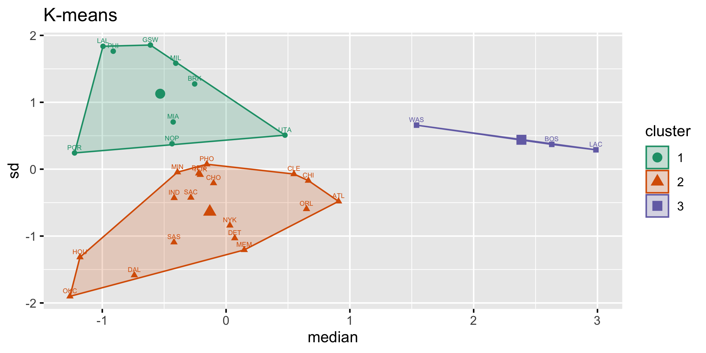
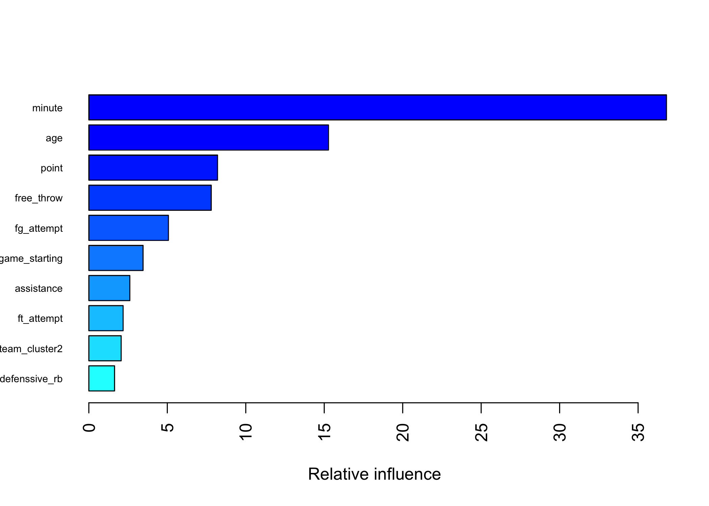

P8106 Final - Final Model: GBM
================
Mingkuan Xu, Mengfan Luo, Yiqun Jin
5/6/2022

# Data Preprocessing

## Feature engineering for tree-based models

We use k-mean clustering to cluster variable `team` in the training data
with class number k = 3. Variable `team` are clustered into the
following 3 clusters:

-   Cluster 1: BRK, GSW, LAL, MIA, MIL, NOP, PHI, POR, UTA
-   Cluster 2: ATL, CHI, CHO, CLE, DAL, DEN, DET, HOU, IND, MEM, MIN,
    NYK, OKC, ORL, PHO, SAC, SAS, TOR
-   Cluster 3: BOS, LAC, WAS

<!-- --><!-- -->

We add class labels for the newly generated clusters of `team` as
`team_cluster`, with values 1, 2, and 3 representing each clusters.

### Final model: GBM

Our best mdoel is Generalized Boosted Regression Modeling (GBM) with
tuning parameters:

-   `n.trees = 6000`: the total number of trees to fit

-   `interaction.depth = 5`: maximum depth of each tree

-   `shrinkage = 0.0008`: learning rate

-   `n.minobsinnode = 1`: the minimum number of observations in the
    terminal nodes of the trees

<!-- -->

    ##    n.trees interaction.depth shrinkage n.minobsinnode
    ## 28    6000                 5     8e-04              1

<!-- -->

    ## A gradient boosted model with gaussian loss function.
    ## 6000 iterations were performed.
    ## There were 27 predictors of which 27 had non-zero influence.

Variable Importance:

10 most important variables (computed from permuting OOB data) are
`minute`, `age`, `point`, `free_throw`, `fg_attempt`, `game_starting`,
`assistance`, `ft_attempt`, `team_cluster`, and `defensive_rb.`

<!-- -->

    ##                         var     rel.inf
    ## minute               minute 36.80766413
    ## age                     age 15.27024366
    ## point                 point  8.20004685
    ## free_throw       free_throw  7.80013401
    ## fg_attempt       fg_attempt  5.07019798
    ## game_starting game_starting  3.45628930
    ## assistance       assistance  2.61183908
    ## ft_attempt       ft_attempt  2.18387162
    ## team_cluster2 team_cluster2  2.06013694
    ## defenssive_rb defenssive_rb  1.63905099
    ## turnover           turnover  1.61437208
    ## personal_foul personal_foul  1.60872804
    ## block                 block  1.56168258
    ## field_goal       field_goal  1.45090683
    ## game                   game  1.36309336
    ## x3p                     x3p  1.36115057
    ## x2p                     x2p  1.28342555
    ## x2p_attempt     x2p_attempt  1.21499282
    ## x3p_attempt     x3p_attempt  1.00544349
    ## steal                 steal  0.69500781
    ## total_rb           total_rb  0.68620168
    ## positionPF       positionPF  0.44308976
    ## offensive_rb   offensive_rb  0.42966587
    ## team_cluster3 team_cluster3  0.10085567
    ## positionSF       positionSF  0.03322843
    ## positionPG       positionPG  0.02802297
    ## positionSG       positionSG  0.02065793

With our fitted GBM model, we can make prediction on new observations.
The RMSE on our test data is 4.745948.

    ## [1] 4.745948

Given GBM is a black-box model, we refer to `lime` package to achieve
explanations of the result of the model on new observations, by fitting
a simpler model to the permuted data with the above 15 most important
features. We randomly selected 6 observations of the test data. The
players’ name, true salary (in million), and predicted salary from GBM
are:

| player           | true_salary | predicted_salary |
|:-----------------|------------:|-----------------:|
| Cade Cunningham  |   10.050120 |         8.590867 |
| Cam Reddish      |    4.670160 |         3.627087 |
| Christian Wood   |   13.666667 |        14.730414 |
| Corey Kispert    |    3.383640 |         3.248053 |
| D’Angelo Russell |   30.013500 |        14.735256 |
| Danuel House Jr. |    2.045094 |         4.792719 |

True and Predicted Salary of 6 Random New Observarions

The explanation of the GBM model from lime are as followed. Inside the
plot, the x-axis shows the relative strength of each variables, and
positive values (blue) show that the the variable increase the value of
the prediction, while the negative values (red) decrease the prediction
value.

Take the first case of player Cade Cunningham as an example. Cade’s true
salary is 10.050120 million. His predicted salary from GBM is 8.590868
million, which are quite similar to each other. Among the 10 most
important variables, factors `mintue > 90`, `point > 0.5`,
`game_starting > 43.8`, `assistance > 0.1241`, `fg_attempt > 0.401` and
`x2p_attempt > 0.269` increases Cade’s salary, while factors
`age <= 23`, `turnover > 0.065`, `0.057 < free_throw <= 0.082` and
`team_cluster = 2` decreases his salary.

<!-- -->
