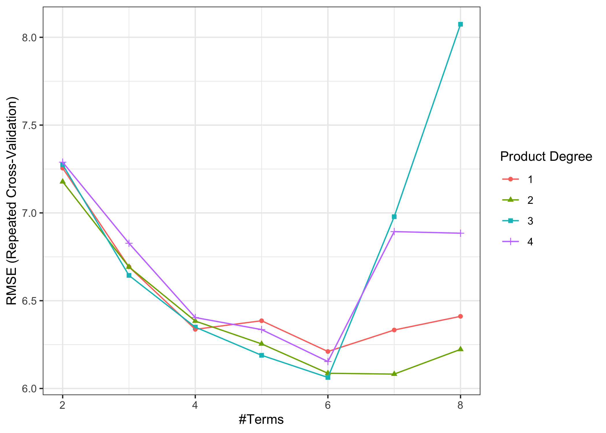
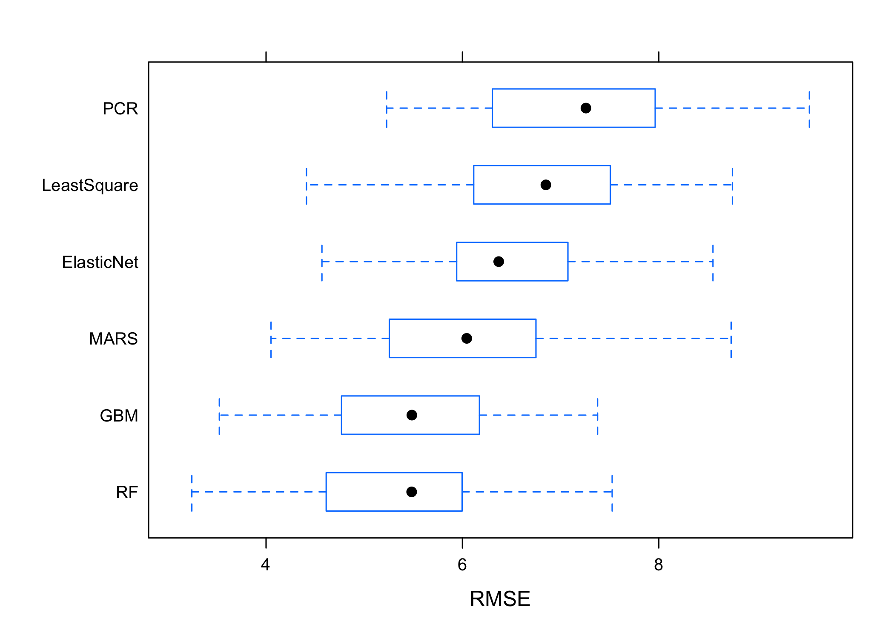

Models except for NN
================
Mingkuan Xu, Mengfan Luo, Yiqun Jin
5/6/2022

# Data Preprocessing

# Models

## Part 1 Linear regression

### (a) Standard Least-Squared

### (b) Elastic Net (including lasso/ridge)

    ##     alpha    lambda
    ## 637   0.6 0.4412332

<!-- -->

### (c) Principle Component Regression

    ##   ncomp
    ## 4     4

<!-- -->

## Part 2 Generalized Linear Regression

### (a) GAM

    ## 
    ## Family: gaussian 
    ## Link function: identity 
    ## 
    ## Formula:
    ## salary ~ s(age) + s(game) + s(game_starting) + s(free_throw) + 
    ##     s(ft_attempt) + s(defenssive_rb) + s(assistance) + s(block) + 
    ##     s(personal_foul) + s(point)
    ## 
    ## Parametric coefficients:
    ##             Estimate Std. Error t value Pr(>|t|)    
    ## (Intercept)   8.5293     0.2958   28.84   <2e-16 ***
    ## ---
    ## Signif. codes:  0 '***' 0.001 '**' 0.01 '*' 0.05 '.' 0.1 ' ' 1
    ## 
    ## Approximate significance of smooth terms:
    ##                    edf Ref.df      F  p-value    
    ## s(age)           4.414  5.455 16.961  < 2e-16 ***
    ## s(game)          1.695  2.101  4.623  0.00973 ** 
    ## s(game_starting) 1.482  1.805 25.494  < 2e-16 ***
    ## s(free_throw)    8.147  8.791  3.083  0.00538 ** 
    ## s(ft_attempt)    1.000  1.000  0.155  0.69382    
    ## s(defenssive_rb) 1.000  1.000  1.680  0.19591    
    ## s(assistance)    1.000  1.000 18.244 2.58e-05 ***
    ## s(block)         1.000  1.000  2.758  0.09777 .  
    ## s(personal_foul) 6.851  7.891  5.172 6.56e-06 ***
    ## s(point)         6.152  7.361  5.415 5.90e-06 ***
    ## ---
    ## Signif. codes:  0 '***' 0.001 '**' 0.01 '*' 0.05 '.' 0.1 ' ' 1
    ## 
    ## R-sq.(adj) =   0.69   Deviance explained = 71.8%
    ## GCV = 34.237  Scale est. = 30.974    n = 354

### (b) MARS

    ##    nprune degree
    ## 19      6      3

<!-- -->

    ## [1] 26.58079

## Part 3 Tree-based models

### Feature engineering for tree-based models

Categorical variable `team` have 30 classes, which will resulted in too
much dummy variables in our models. Therefore, we consider clustering
`team` into fewer class according to similar trends in the median and
standard deviation of player’s salary in each team.

We use k-mean clustering to cluster variable `team` in the training data
with class number k = 3. Variable `team` are clustered into the
following 3 clusters:

-   Cluster 1: BRK, GSW, LAL, MIA, MIL, NOP, PHI, POR, UTA
-   Cluster 2: ATL, CHI, CHO, CLE, DAL, DEN, DET, HOU, IND, MEM, MIN,
    NYK, OKC, ORL, PHO, SAC, SAS, TOR
-   Cluster 3: BOS, LAC, WAS

<!-- --><!-- -->

We add class labels for the newly generated clusters of `team` as
`team_cluster`, with values 1, 2, and 3 representing each clusters.

### (a) Random forest

    ##    mtry splitrule min.node.size
    ## 97   26  variance             1

<!-- -->

### (b) Generalized Boosted Regression Modeling (GBM)

    ##    n.trees interaction.depth shrinkage n.minobsinnode
    ## 28    6000                 5     8e-04              1

<!-- -->

    ## A gradient boosted model with gaussian loss function.
    ## 6000 iterations were performed.
    ## There were 27 predictors of which 27 had non-zero influence.

|             | Min. | 1st Qu. | Median | Mean | 3rd Qu. | Max. | NA’s |
|:------------|-----:|--------:|-------:|-----:|--------:|-----:|-----:|
| LeastSquare | 4.41 |    6.12 |   6.85 | 6.79 |    7.46 | 8.75 |    0 |
| ElasticNet  | 4.57 |    5.95 |   6.37 | 6.45 |    7.06 | 8.55 |    0 |
| PCR         | 5.23 |    6.32 |   7.26 | 7.16 |    7.93 | 9.53 |    0 |
| MARS        | 4.05 |    5.26 |   6.04 | 6.06 |    6.74 | 8.74 |    0 |
| RF          | 3.24 |    4.66 |   5.48 | 5.42 |    5.99 | 7.52 |    0 |
| GBM         | 3.52 |    4.79 |   5.48 | 5.41 |    6.11 | 7.38 |    0 |

RMSE of Different Models

<!-- -->

|      | Linear | ElasticNet | PCR  | GAM  | MARS | RandomForest | GBM  |
|:-----|:-------|:-----------|:-----|:-----|:-----|:-------------|:-----|
| RMSE | 6.66   | 6.04       | 5.39 | 6.84 | 5.16 | 4.83         | 4.75 |

RMSE of Different Models on Test Set
