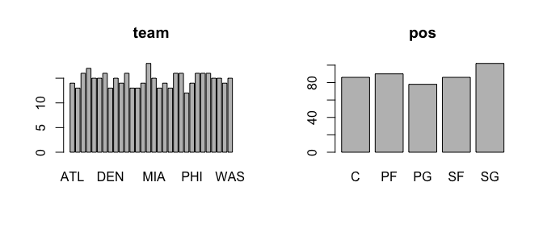
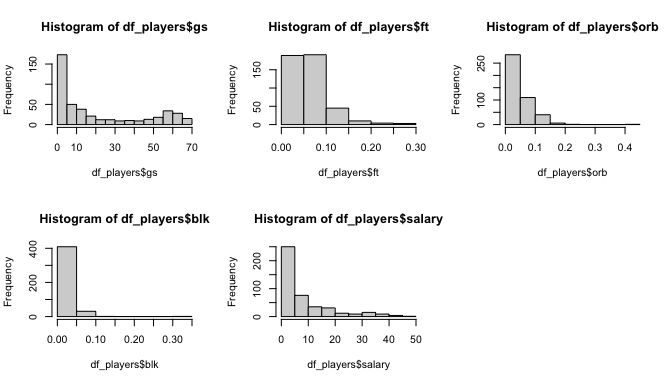
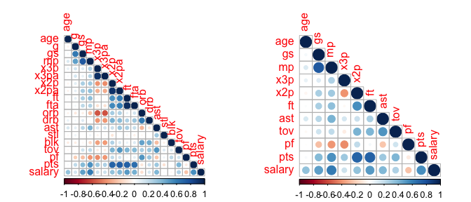
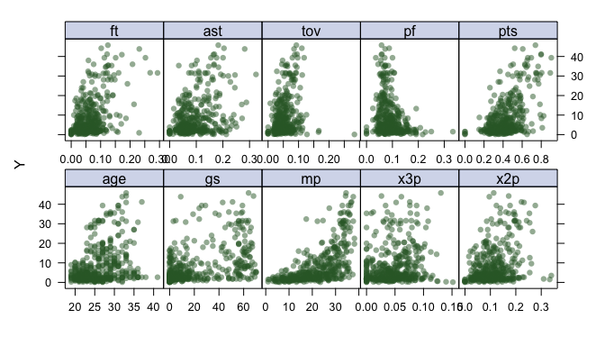
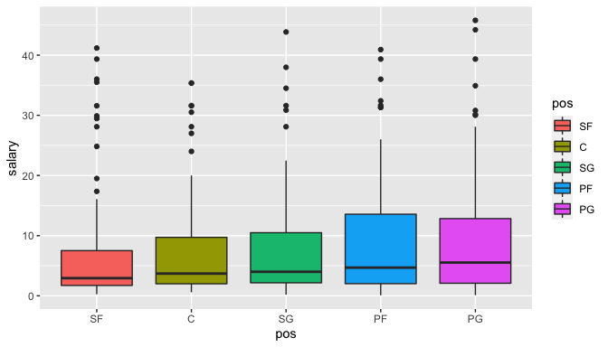
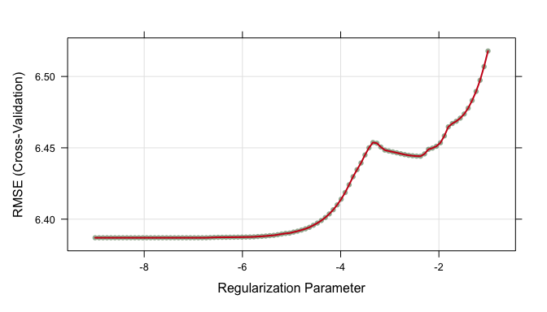
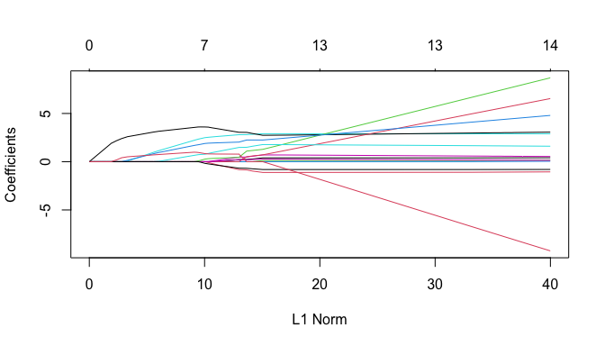
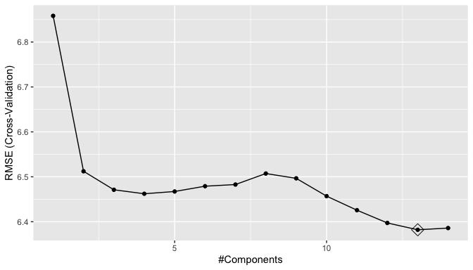
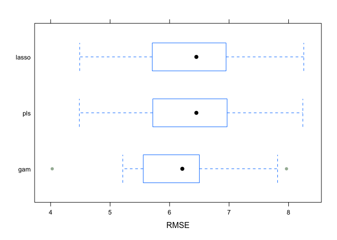
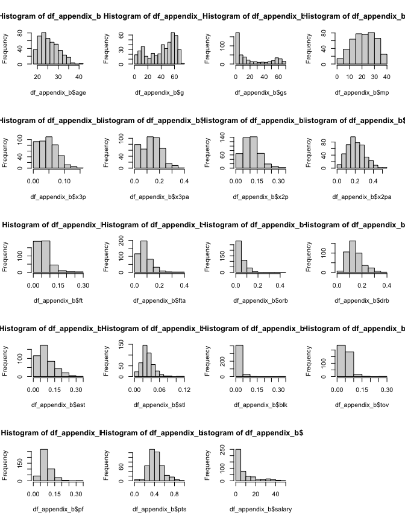

P8106 - Midterm Project - NBA Players Salary Prediction
================
Mengfan Luo (ml4701)
03/26/2022

## Introduction

NBA players are considered to be among the highest-paid athletes in the
world. Despite even the minimum wage in the NBA is way higher than that
of any professional league in North America, there’s a large gap between
NBA stars and ordinary players\[1\]. In this project, we are interested
in finding the factors that influence salary of NBA players. We will
also develop a model to predict the salary.

We will conduct data analysis and model construction based on two
datasets on NBA players’ contracted salary \[2\] and performance
statistics per game \[3\] in 2021-2022. The following steps are included
in our data preperation:

-   Two original datasets are inner joined by players and teams
-   Keep only one record with most number of games played for each of
    players, given a player may transfer to other teams during the
    session and have multiple records.
-   Remove 5 variables with missing values caused by division of other
    existing variables.
-   Remove variable representing the player name.

The final cleaned dataset has 442 records and 24 variables.

## Exploratory analysis and visualization

There are 24 variables in our cleaned dataset, with 2 categorical
variables, 21 numerical variables and 1 numeric response variable
`salary`. A summary of predictors are provided in appendix A.

Looking into the variables, we find some variables can be derived from
other variables by simple addition. For example, `fg = x3p+x2p`, number
of field goals = summation of number of 3-point goals and 2-point goals.
Therefore, 3 grouped variables `fg`,`fga`, `trb` are removed. Since `mp`
stands for minutes played per game, we will divided variables stands for
counts by `mp` to get a rate. These variables includes
`x3p`,`x3pa`,`x2p`, `x2pa`, `ft`, `fta`, `orb`, `drb`, `ast`, `stl`,
`blk`, `tov`, `pf` and `pts`.

### Univariate analysis

The following plots show distribution of each univariable. For
categorical variables `team` and `pos`, they are dsitributed quite
evenly. There are 30 unique values in `team` and 5 in `pos`. We may
consider remove `team` for it may result in too many dummy variables in
the model.

<!-- -->

For numeric variables, some of them (`gs`, `ft`, `orb`,`blk`), including
response `salary` are skewed, with some players have extremely high
salary. Visualization for all variables are enclosed in Appendix B

<!-- -->

### Correlation Analysis

From correlation plot for remaining numeric variable (left), we find
rate of goals (`x3p`,`x2p`,and `fp`) and rate of goal attempts
(`x3pa`,`x2pa`,and `fpa`) are highly correlated. Therefore, all goal
attempts will be further excluded. Besides, `g`, `orb`,`blk`, `stl`, and
`drb` are lowly correlated with response `salary`, so we may remove them
to reduce variance. The resulting correlation plot is shown in the
right. Still some high correlation remains (`pts` and `x2p`, `pts` and
`ft`, `mp` and `gs`).

<!-- -->

### Analyzing trends in data

From numeric variables, we found that `stl`,`x3p`, `age`,`gs` seem to
have some non-linear trends.

<!-- -->

From categorical variable `pos`, extremely high values in salary show in
all positions and some teams.

<!-- -->

## Models

### Data Partition and Transformation

From above exploratory analysis, we removed and engineered some
variables. There are 11 variables, `pos`,`age`,`gs` ,`mp`
,`x3p`,`x2p`,`ft` ,`ast`, `tov`,`pf` and `pts` that will be used for
further model building.

We partition the dataset into 334 training data (75%) and 108 test data
(25%). We will use 10-fold CV to compare each model using training data,
and then select a best model to predict on test data.

Since there are some correlation with variables, methods such as PLS
will be considered to reduce variance. Also, since there were some
non-leanrity in some variables, methods such as GAM will also be
considered.

Because these above methods are all parametric methods and based on
assumption of normality, we considering doing transformation on the
numeric predictors. We will use Yeo-Johnson transformation because there
are many 0 value in our predictors.

### Lasso

Lasso is a linear model with a penalty term. The parameter lambda is
tried from exp(-9) to exp(-1), and picked based on lowest CV RMSE. Here
lambda = 0.001093708. All variables `pos` ,`age`, `gs`, `mp` , `x3p`
,`x2p` , `ft` , `ast` , `tov`, `pf` and `pts` are included. Lasso is
good interms of iterprebility. we can see from the coeficients that `pf`
and `pts` are inversely correlated with salary, while the others are
positively correlated. However, `pts` is the rate of getting points each
game, so it doesn’t make sense that the more points one player can get
in unit time, the less salary he has. This problem may caused by
correlation between `pts` and several other variables. Lasso should be
able to perform function of variable selection, but here all variables
are selected into the final model. Another drawback of lasso is that it
is not able to deal with possible non-linear trend in the predictors.

<!-- -->

<!-- -->

### PLS

For PLS, the parameter is number of components ncomp. n = 13 is selected
for lowest CV RMSE. All variables are included to form the 13
components. PLS can reduce the dimension of predictors, but possible
drawback of PLS are that it cannot handle interactions between original
variables, as well as cannot handle non-linerity.

<!-- -->

### GAM

For GAM, there’s no parameters. From the model, variables except for
`gs` are included. The degrees of freedom are shown as followed. The GAM
model can capture the non-linear trend in the model, but it may have a
high variance.

<table>
<thead>
<tr>
<th style="text-align:left;">
var
</th>
<th style="text-align:right;">
df
</th>
</tr>
</thead>
<tbody>
<tr>
<td style="text-align:left;">
pos
</td>
<td style="text-align:right;">
NA
</td>
</tr>
<tr>
<td style="text-align:left;">
age
</td>
<td style="text-align:right;">
6.508
</td>
</tr>
<tr>
<td style="text-align:left;">
mp
</td>
<td style="text-align:right;">
3.099
</td>
</tr>
<tr>
<td style="text-align:left;">
x3p
</td>
<td style="text-align:right;">
2.283
</td>
</tr>
<tr>
<td style="text-align:left;">
x2p
</td>
<td style="text-align:right;">
0.178
</td>
</tr>
<tr>
<td style="text-align:left;">
ft
</td>
<td style="text-align:right;">
7.345
</td>
</tr>
<tr>
<td style="text-align:left;">
ast
</td>
<td style="text-align:right;">
7.330
</td>
</tr>
<tr>
<td style="text-align:left;">
tov
</td>
<td style="text-align:right;">
1.754
</td>
</tr>
<tr>
<td style="text-align:left;">
pf
</td>
<td style="text-align:right;">
3.427
</td>
</tr>
<tr>
<td style="text-align:left;">
pts
</td>
<td style="text-align:right;">
2.199
</td>
</tr>
</tbody>
</table>

### Model Comparison

The CV RMSE are showned as followed. We can see GAM model has lowest
RMSE. Using GAM model to do prediction, the test RMSE is 5.517879, quite
similar to CV RMSE results.

<!-- -->

## Conclusions

From the above analysis and model, we can predict salary of NBA players
with GAM model. Predictors includes `pos` , `age`, `mp` , `x3p` , `x2p`
, `ft` , `ast` , `tov`, `pf` , `pts`, and the corresponding degree of
freedoms and interpretations are as followed. We can see that GAM model
have a low bias, possibly thanks to its ability of capturing the
non-linear trend in the model. Also, from the bloxplot above, GAM model
also has lowest variance in the three models, which is quite ideal.

<table>
<thead>
<tr>
<th style="text-align:left;">
var
</th>
<th style="text-align:right;">
df
</th>
<th style="text-align:left;">
interpret
</th>
</tr>
</thead>
<tbody>
<tr>
<td style="text-align:left;">
pos
</td>
<td style="text-align:right;">
NA
</td>
<td style="text-align:left;">
position of player
</td>
</tr>
<tr>
<td style="text-align:left;">
age
</td>
<td style="text-align:right;">
6.508
</td>
<td style="text-align:left;">
age of player
</td>
</tr>
<tr>
<td style="text-align:left;">
mp
</td>
<td style="text-align:right;">
3.099
</td>
<td style="text-align:left;">
miniutes played per game
</td>
</tr>
<tr>
<td style="text-align:left;">
x3p
</td>
<td style="text-align:right;">
2.283
</td>
<td style="text-align:left;">
rate making of 3-point goal
</td>
</tr>
<tr>
<td style="text-align:left;">
x2p
</td>
<td style="text-align:right;">
0.178
</td>
<td style="text-align:left;">
rate of making 2-point goal
</td>
</tr>
<tr>
<td style="text-align:left;">
ft
</td>
<td style="text-align:right;">
7.345
</td>
<td style="text-align:left;">
rate of making free throw
</td>
</tr>
<tr>
<td style="text-align:left;">
ast
</td>
<td style="text-align:right;">
7.330
</td>
<td style="text-align:left;">
rate of assistance
</td>
</tr>
<tr>
<td style="text-align:left;">
tov
</td>
<td style="text-align:right;">
1.754
</td>
<td style="text-align:left;">
rate of turn over
</td>
</tr>
<tr>
<td style="text-align:left;">
pf
</td>
<td style="text-align:right;">
3.427
</td>
<td style="text-align:left;">
rate of personal fouls
</td>
</tr>
<tr>
<td style="text-align:left;">
pts
</td>
<td style="text-align:right;">
2.199
</td>
<td style="text-align:left;">
rate of getting points in each game
</td>
</tr>
</tbody>
</table>

## References

\[1\]<https://www.hoopsrumors.com/2021/08/nba-minimum-salaries-for-2021-22.html>

\[2\]<https://www.basketball-reference.com/contracts/players.html>

\[3\]<https://www.basketball-reference.com/leagues/NBA_2022_per_game.html>

## Appendices

### Appendix A - Variables in Original Dataset

-   salary: salary of the player in millions (Response)
-   pos – Position of the player (5 categories)
-   age – Player’s age on February 1 of the season
-   team – Team that the player belong to. (30 categories)
-   g – Number of Games Participated
-   gs – Number of Games Started
-   mp – Minutes Played Per Game
-   fg – Field Goals Per Game (Count)
-   fga – Field Goal Attempts Per Game (Count)
-   x3p – 3-Point Field Goals Per Game (Count)
-   x3pa – 3-Point Field Goal Attempts Per Game (Count)
-   x2p – 2-Point Field Goals Per Game (Count)
-   x2pa – 2-Point Field Goal Attempts Per Game (Count)
-   ft – Free Throws Per Game (Count)
-   fta – Free Throw Attempts Per Game (Count)
-   orb – Offensive Rebounds Per Game (Count)
-   drb – Defensive Rebounds Per Game (Count)
-   trb – Total Rebounds Per Game (Count)
-   ast – Assists Per Game (Count)
-   stl – Steals Per Game (Count)
-   blk – Blocks Per Game (Count)
-   tov – Turnovers Per Game (Count)
-   pf – Personal Fouls Per Game (Count)
-   pts – Points Per Game

### Appendix B - Variable Distribution

<!-- -->
