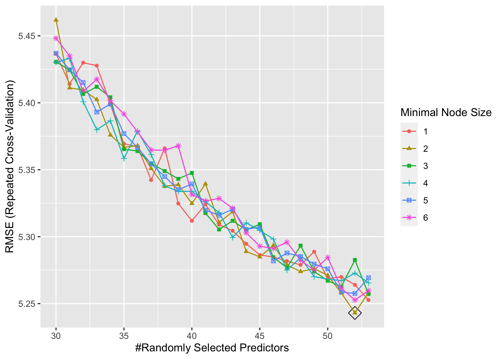
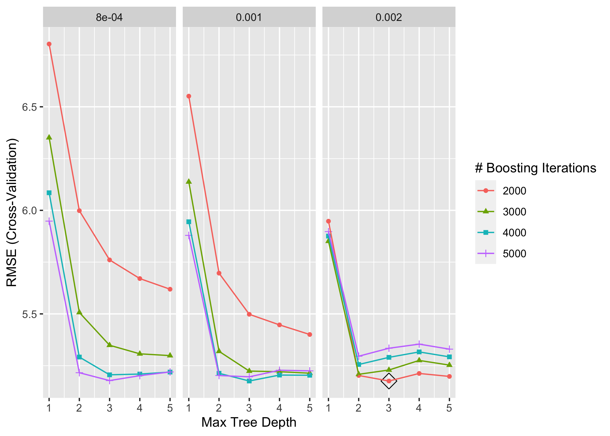
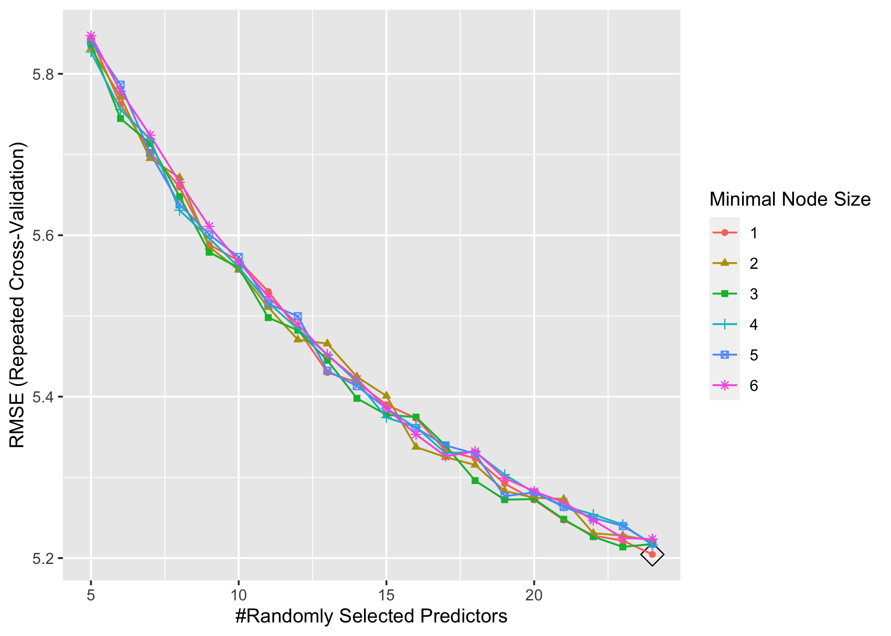
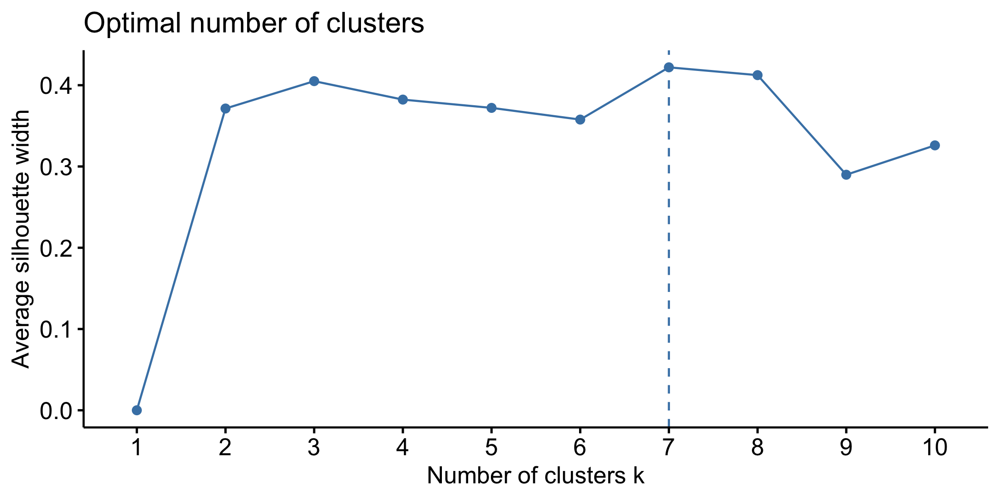
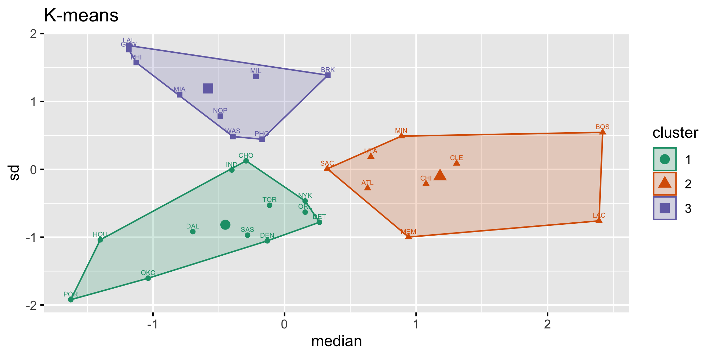
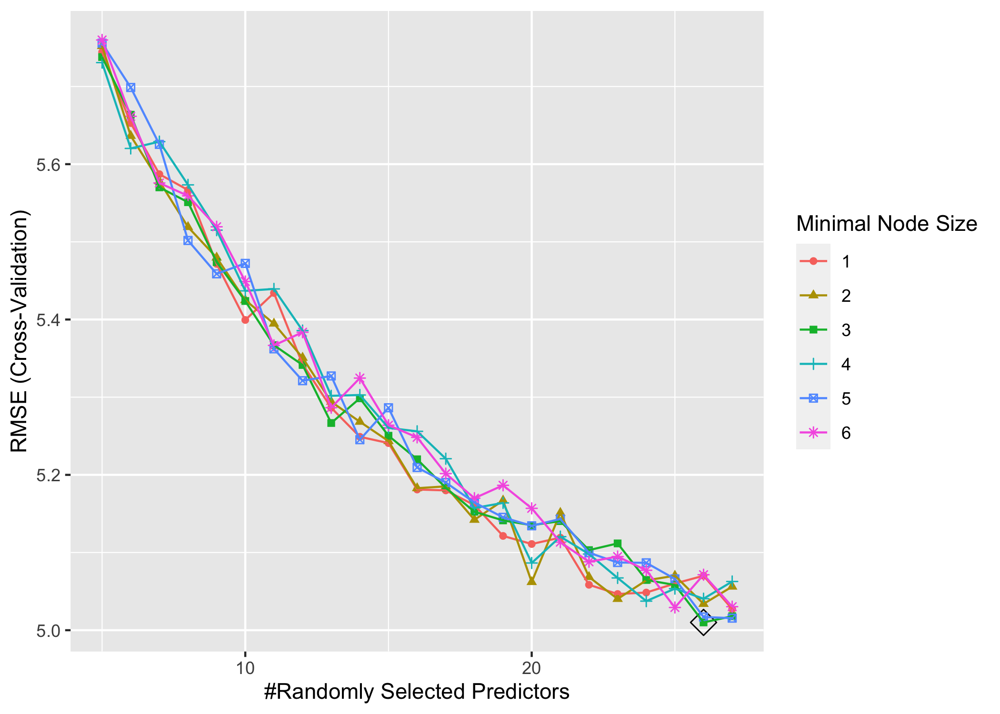

Random Forest and Boosting
================
DS2
5/6/2022

## Part 0 - Data Preprocessing

## Part 1 - Exploratory Analysis

Since `minute` stands for minutes played per game, we will divided
variables stands for counts by `minute` to get a rate. These variables
includes `field_goal`, `fg_attempt` `x3p`, `x3p_attempt`, `x2p`,
`x2p_attempt`, `free_throw`, `ft_attempt`, `offensive_rb`
`defenssive_rb`, `total_rb`, `assistance`,`steal`, `block`, `turnover`,
`personal_foul` and `point`.

### Univariate Analysis

Distributions of the two categorical variables, `team` and `position`.

<!-- --><!-- -->

Distributions of other numeric variables.

<!-- --><!-- --><!-- -->

### Correlation Analysis

<!-- -->

### Analyzing trends in data

From numeric variables, we found that `stl`,`x3p`, `age`,`gs` seem to
have some non-linear trends.

<!-- -->

From categorical variable `position`, extremely high values in salary
show in all positions and some teams.

<!-- -->

## Tree-based models

### With variable `team`

#### 1-1. Random forest

    ##     mtry splitrule min.node.size
    ## 124   50  variance             4

<!-- -->

#### 1-2. gbm

    ##    n.trees interaction.depth shrinkage n.minobsinnode
    ## 49    2000                 3     0.002              1

<!-- -->

    ## A gradient boosted model with gaussian loss function.
    ## 2000 iterations were performed.
    ## There were 54 predictors of which 39 had non-zero influence.

### Without variable `team`

#### 2-1. Random forest

    ##     mtry splitrule min.node.size
    ## 115   24  variance             1

<!-- -->

#### 2-2. gbm

    ##    n.trees interaction.depth shrinkage n.minobsinnode
    ## 31    4000                 3     0.001              1

<!-- -->

    ## A gradient boosted model with gaussian loss function.
    ## 4000 iterations were performed.
    ## There were 25 predictors of which 25 had non-zero influence.

### With variable `team` clustered into 3 clusters

Categorical variable `team`have 30 classes, which will resulted in too
much dummy variables in our models. Therefore, we consider clustering
`team` into fewer class according to similar trends in the median and
standard deviation of player’s salary in each team.

We use k-mean clustering to cluster variable `team` in the training data
with class number k = 3. Variable `team` are clustered into the
following 3 clusters:

-   Cluster 1: CHO, DAL, DEN, DET, HOU, IND, NYK, OKC, ORL, POR, SAS,
    TOR
-   Cluster 2: ATL, BOS, CHI, CLE, LAC, MEM, MIN, SAC, UTA
-   Cluster 3: BRK, GSW, LAL, MIA, MIL, NOP, PHI, PHO, WAS

<!-- --><!-- -->

We add class labels for the newly generated clusters of `team` as
`team_cluster`, with values 1, 2, and 3 representing each clusters.

#### 3-1. Random forest

    ##     mtry splitrule min.node.size
    ## 129   26  variance             3

<!-- -->

#### 3-2. gbm

    ##    n.trees interaction.depth shrinkage n.minobsinnode
    ## 14    4000                 4     0.001              1

<!-- -->

    ## A gradient boosted model with gaussian loss function.
    ## 4000 iterations were performed.
    ## There were 27 predictors of which 27 had non-zero influence.

Comparison of Tree-based models

<!-- -->

    ##              model  cv_rmse
    ## 1               rf 5.201816
    ## 2              gbm 5.175928
    ## 3       rf_no_team 5.057161
    ## 4      gbm_no_team 5.086211
    ## 5  rf_cluster_team 5.010028
    ## 6 gbm_cluster_team 5.023088
