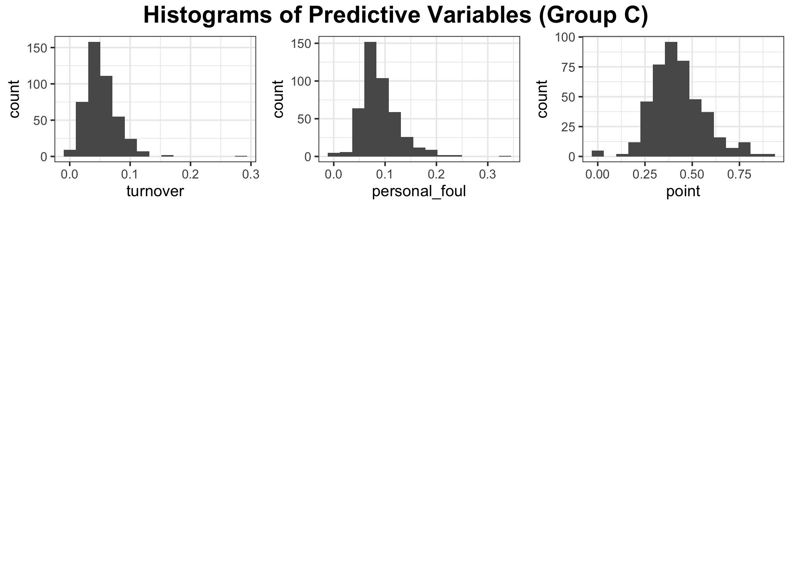
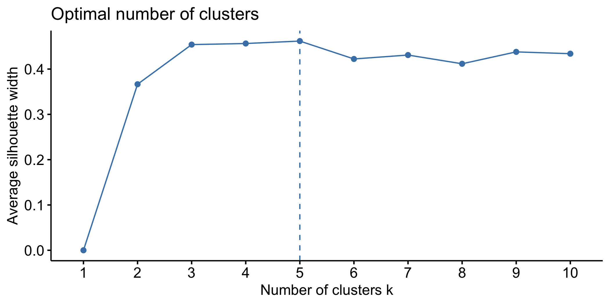
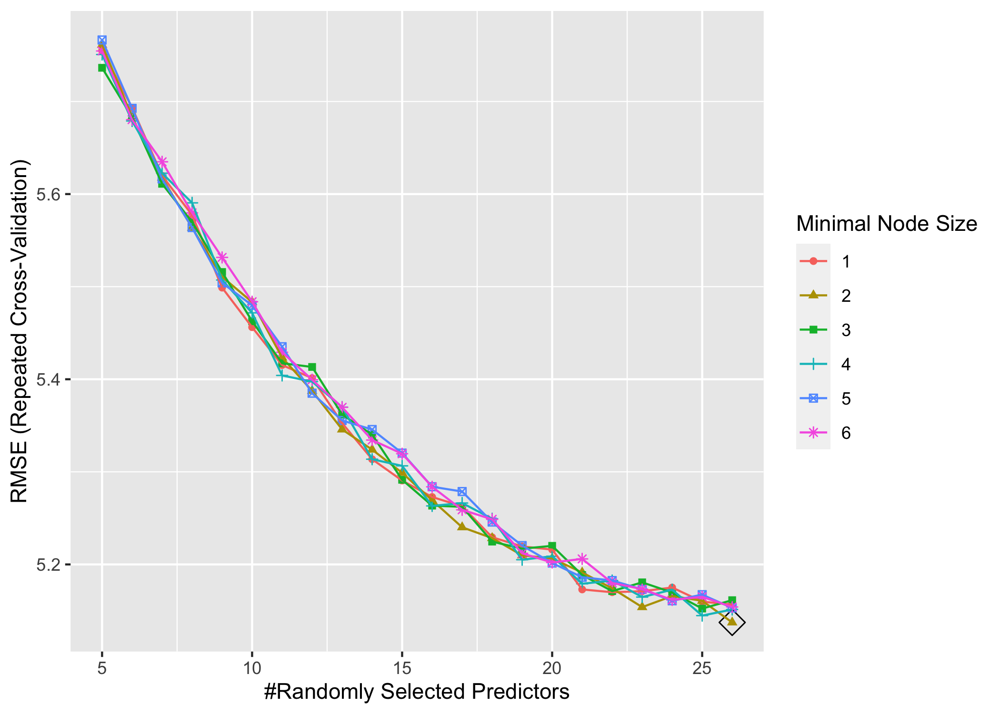
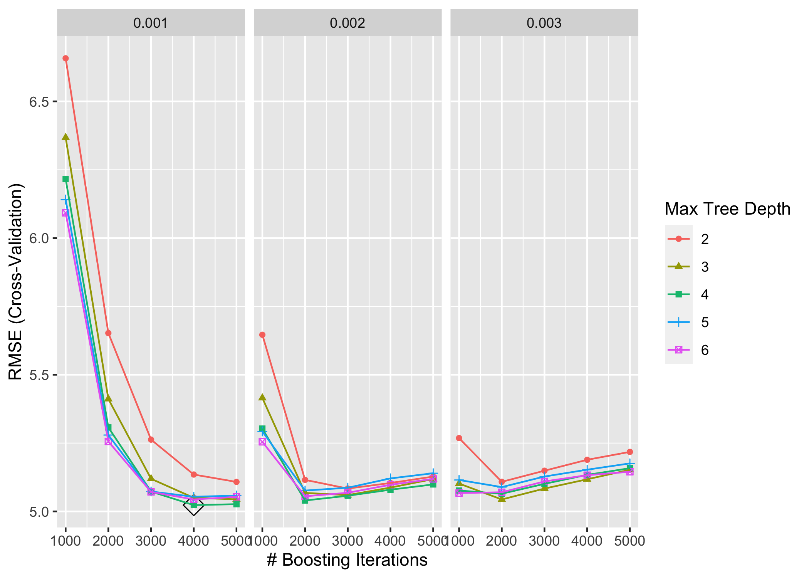
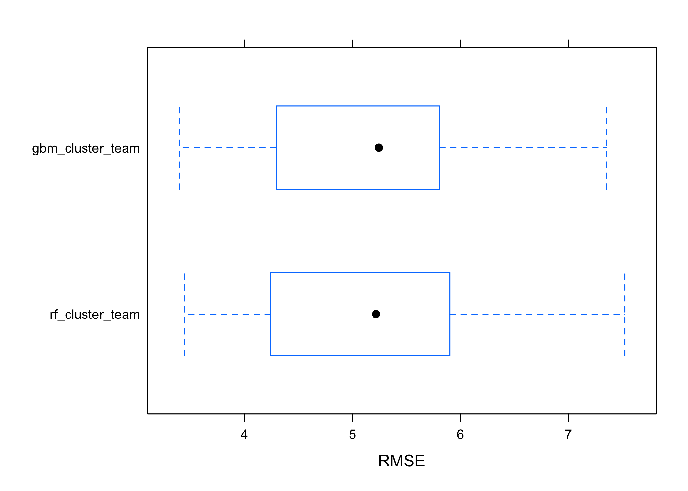
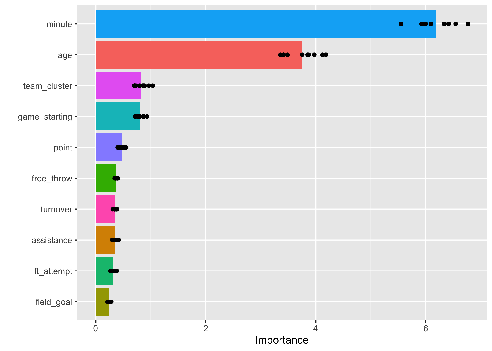
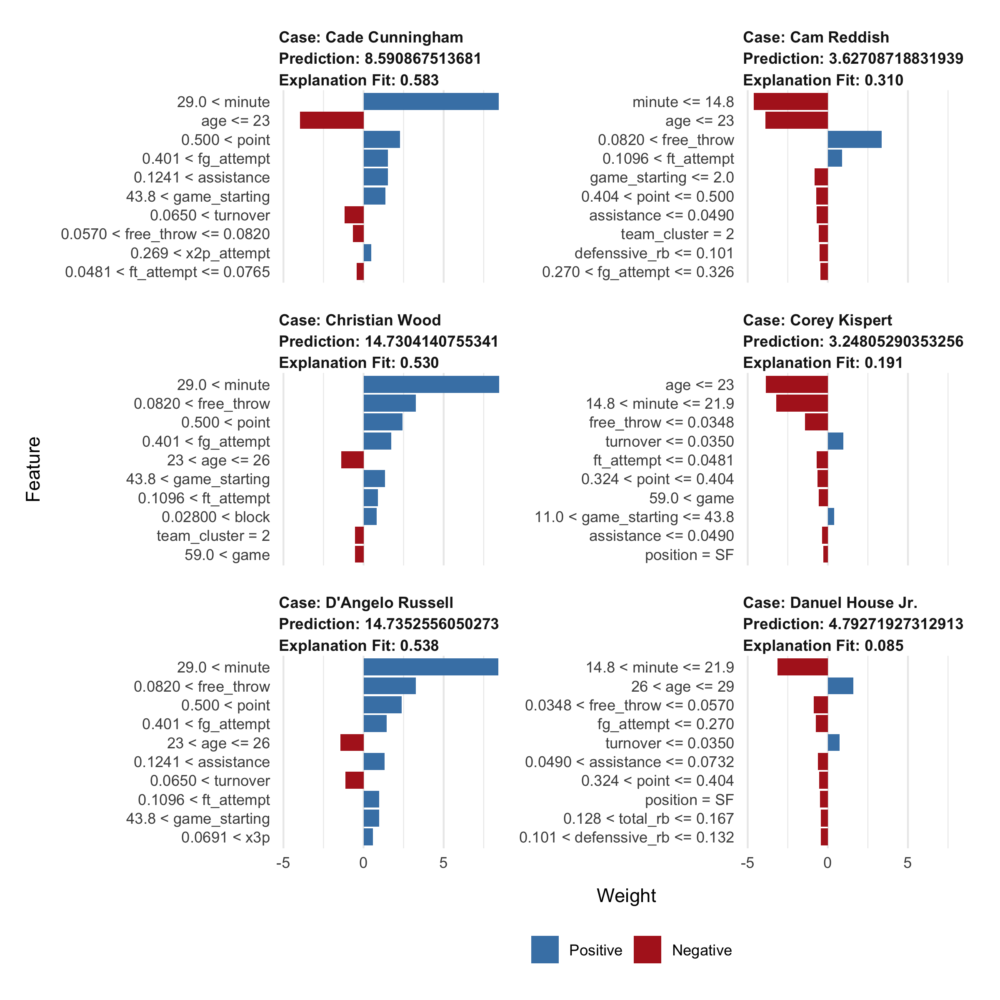

Random Forest and Boosting
================
DS2
5/6/2022

## Part 0 - Data Preprocessing

## Part 1 - Exploratory Analysis

Since `minute` stands for minutes played per game, we will divided
variables stands for counts by `minute` to get a rate. These variables
includes `field_goal`, `fg_attempt` `x3p`, `x3p_attempt`, `x2p`,
`x2p_attempt`, `free_throw`, `ft_attempt`, `offensive_rb`
`defenssive_rb`, `total_rb`, `assistance`,`steal`, `block`, `turnover`,
`personal_foul` and `point`.

### Univariate Analysis

Distributions of the two categorical variables, `team` and `position`.

<!-- --><!-- -->

Distributions of other numeric variables.

<!-- --><!-- --><!-- -->

### Correlation Analysis

<!-- -->

### Analyzing trends in data

From numeric variables, we found that `stl`,`x3p`, `age`,`gs` seem to
have some non-linear trends.

<!-- -->

From categorical variable `position`, extremely high values in salary
show in all positions and some teams.

<!-- -->

## Tree-based models

Categorical variable `team`have 30 classes, which will resulted in too
much dummy variables in our models. Therefore, we consider clustering
`team` into fewer class according to similar trends in the median and
standard deviation of player’s salary in each team.

We use k-mean clustering to cluster variable `team` in the training data
with class number k = 3. Variable `team` are clustered into the
following 3 clusters:

-   Cluster 1: CHO, DAL, DEN, DET, HOU, IND, NYK, OKC, ORL, POR, SAS,
    TOR
-   Cluster 2: ATL, BOS, CHI, CLE, LAC, MEM, MIN, SAC, UTA
-   Cluster 3: BRK, GSW, LAL, MIA, MIL, NOP, PHI, PHO, WAS

<!-- --><!-- -->

We add class labels for the newly generated clusters of `team` as
`team_cluster`, with values 1, 2, and 3 representing each clusters.

### Random forest

    ##     mtry splitrule min.node.size
    ## 128   26  variance             2

<!-- -->

### gbm

    ##    n.trees interaction.depth shrinkage n.minobsinnode
    ## 47    2000                 6     0.002              1

<!-- -->

    ## A gradient boosted model with gaussian loss function.
    ## 2000 iterations were performed.
    ## There were 27 predictors of which 27 had non-zero influence.

### Comparison of Tree-based models

<!-- -->

    ##              model  cv_rmse
    ## 1  rf_cluster_team 5.137371
    ## 2 gbm_cluster_team 5.102139

### Best tree model

Random forest with tuning parameters:

-   `mytry = 26`: number of variables to possibly split at in each node.

-   `min.node.size = 3`: Optimal minimal node size.

Test error:

    ## [1] 5.559568

Variable Importance:

<!-- -->

Prediction on new observations:

<!-- -->

True salary (in million) for new observations:

    ##                  salary
    ## Aaron Gordon  16.409091
    ## Aaron Wiggins  1.000000
    ## Al Horford    27.000000
    ## Alize Johnson  0.804978
    ## Anthony Davis 35.361360
    ## Anthony Gill   1.517981
